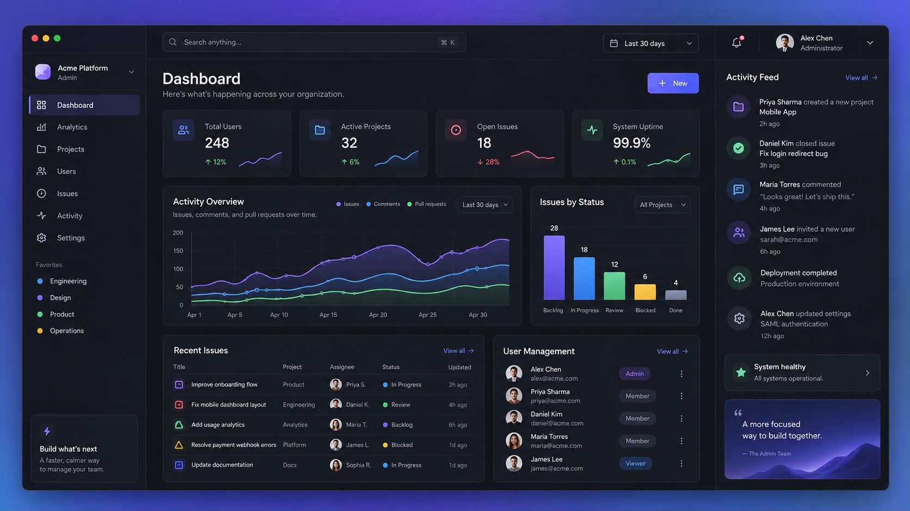

# FINSEC SEAL 통합 Design System

> 차콜 기반의 차분한 업무 화면에서, 검증 대상·실행 증거·정책 적용·내부 판정을 정확하게 읽고 조작하는 금융 AI Agent 검증 콘솔.

> **구현 현황 안내:** 이 문서의 기존 A 6개 메뉴·라우팅 미구현·B/C/D 확장 예정 표기는 초기 설계 시점의 기록입니다. 현재는 전체 샘플 화면과 hash 탐색이 적용됐습니다. 실제 구현/실연동 상태와 역할별 작업은 [프론트 인수인계](docs/FRONTEND_ROLE_HANDOFF.md), 적용된 화면/토큰은 [Figma 적용 기록](docs/FIGMA_FRONTEND_HANDOFF.md)과 `src/styles.css`를 확인하세요.

## 빠른 탐색

| 확인하려는 내용 | 읽을 위치 |
| --- | --- |
| 문서 범위·기존 명세와의 관계 | [0. 문서 정보와 적용 범위](#0-문서-정보와-적용-범위) |
| 사진이 주는 인상·레이아웃 근거 | [1. 디자인 방향](#1-디자인-방향), [2. 참조 이미지 분석](#2-참조-이미지-분석) |
| A·B·C·D 메뉴와 책임 | [3. 제품 정보 구조와 역할 경계](#3-제품-정보-구조와-역할-경계) |
| 색·글자·간격·레이아웃 | [4. 색상 시스템](#4-색상-시스템)부터 7절까지 |
| 버튼·폼·표·피드백 상세 | [8. 공통 인터랙션과 상태](#8-공통-인터랙션과-상태)부터 12절까지 |
| PASS·DENY·STALE 등의 정확한 의미 | [13. 도메인 상태 표현 사전](#13-도메인-상태-표현-사전) |
| 근거·JSON·그래프 | 14절, [15. 데이터 시각화](#15-데이터-시각화) |
| 현재 A 화면에 적용할 내용 | [16. A 콘솔 화면별 적용 명세](#16-a-콘솔-화면별-적용-명세) |
| 전체 검증 서비스 확장 | 17–20절: 역할별 화면, 데이터 진실성, 접근성, 문구 |
| 구현용 변수·이전 순서 | [21. 통합 CSS Token 초안](#21-통합-css-token-초안), [22. 구현 구조와 단계적 적용](#22-구현-구조와-단계적-적용) |
| 검수·남은 결정·출처 | [23. 검수 체크리스트와 완료 기준](#23-검수-체크리스트와-완료-기준)부터 25절까지 |

디자인 방향 검토는 1–4절과 16절, 실제 개발은 7–14절과 21–23절부터 읽는다. 화면의 상태 의미가 헷갈릴 때는 13절을 기준으로 확인한다.

## 0. 문서 정보와 적용 범위

| 항목 | 내용 |
| --- | --- |
| 문서 버전 | 0.1.0 |
| 작성일 | 2026-09-06 |
| 상태 | 디자인 방향을 구현 규칙으로 정리한 초안. 팀 검토 및 실제 화면 검증 전 |
| 기준 이미지 | 사용자가 제공한 Acme Platform 다크 대시보드 이미지 |
| 기준 코드 | FE `feat/role-a-console`, `54f4b92`에서 확인한 A 콘솔 |
| 적용 제품 | FINSEC SEAL 웹 운영·검증 콘솔 |
| 직접 적용 대상 | Overview, Agents, Releases, Evidence, Audit, Recovery |
| 확장 대상 | Attack Tests, Tool Trace, Findings, Safety Contract, Replay, Metrics, Decision, Report |
| 기본 테마 | Dark / Charcoal + Violet |
| 주요 검토 화면 크기 | 1440×900, 1600×1000; 1280×800, 1024×768 및 좁은 화면 별도 검토 |
| 문서의 효과 | 공통 디자인 기준 제안. 이 문서 작성만으로 UI·API·권한·데이터 계약이 변경되지는 않음 |

### 0.1 이 문서를 읽는 방법

본문은 다음 세 종류를 구분한다.

- **관찰:** 제공 이미지 또는 현재 소스 코드에서 실제 확인한 내용.
- **설계 규칙:** FINSEC SEAL에 적용하기 위해 이 문서에서 제안하는 구체적 기준. 별도 표시가 없는 치수·토큰·컴포넌트 동작은 여기에 해당한다.
- **확장 명세:** 기존 제품 문서에 있으나 현재 A 프론트에서 구현 완료를 확인하지 않은 기능을 위한 디자인 계약.

이미지만으로 원본 CSS, 정확한 글꼴, hover 상태, 반응형 구조, 접근성 준수 여부를 알 수 없다. 아래 정확한 HEX·px·ms 값은 원본에서 추출한 정답이 아니라 **구현 가능한 신규 기준값**이다.

### 0.2 문서 간 우선순위

1. 데이터·권한·상태 전이·보안 판정은 실제 API 계약과 관련 도메인 명세를 따른다.
2. 제품 목적과 승인 경계는 기존 PRD, UI/UX 명세, 역할 분담을 유지한다.
3. 시각 표현은 사용자 지정 이미지와 이 문서의 토큰·레이아웃 기준으로 통합한다.
4. 구현 코드와 디자인 초안이 다르면 차이를 기록하고, 문서를 작성했다는 이유로 기존 동작을 제거하지 않는다.

기존 문서·구현과의 차이:

| 항목 | 기존 근거 | 이번 통합 방향 |
| --- | --- | --- |
| 테마 | 웹 데모 명세의 밝은 배경·네이비 | 차콜 다크·바이올렛으로 시각 기준 교체 제안 |
| 현재 A 화면 | 녹색 배경·민트 CTA | 중립 차콜 배경·보라 CTA, 민트는 긍정 상태에 사용 |
| 사이드바 | 웹 데모 명세 72px, 현재 A 248px | 데스크톱 224–232px 레이블형, 좁은 데스크톱에서 72px 축약 |
| 우측 패널 | 웹 데모 명세의 1280px 이상 4열 | 본문 가독성을 확보한 1440px 이상에서 기본 노출; 부족하면 drawer |
| 핵심 제품 흐름 | Release Detail 중심 Golden Flow | 유지. Overview 스타일 정비가 제품 P0의 대체는 아님 |
| 이번 적용 순서 | 전체 데모 구현 순서와 별개 | 사용자가 만든 A 화면을 먼저 정리하고 같은 컴포넌트를 B·C·D로 확장 |
| 상태 의미 | 내부 판정, 합성 Sandbox, deterministic evidence | 변경하지 않음 |

### 0.3 범위 밖

- 소비자용 계좌·잔액·대출 신청 서비스, 공식 인증 사이트, 운영 금융 관제 서비스로의 전환.
- 로그인, 조직 관리, 사용자 초대, 알림, 전역 검색 등 참조 이미지에 있다는 이유만으로 추가하는 기능.
- 디자인 변경을 위한 백엔드 계약 수정, 임의 상태 생성, 정책 자동 승인.
- 신규 로고 확정, 유료 글꼴 도입, 신규 차트·상태관리 라이브러리 설치.
- 이 문서만으로 WCAG 준수, 보안 적합성, 전체 기능 구현 완료를 선언하는 것.

## 1. 디자인 방향

### 1.1 한 문장

**차분한 차콜 표면, 절제된 바이올렛 강조, 정확한 상태·증거 표현을 갖춘 고밀도 Enterprise Release Console.**

### 1.2 핵심 인상

| 키워드 | 화면에서 구현하는 방법 |
| --- | --- |
| 차분함 | 중립 배경, 낮은 강도의 패널 경계, 과도한 발광 제거 |
| 전문성 | 정렬된 수치, 일관된 표, 명확한 용어, 조회 기준 표시 |
| 검증 가능성 | 결과 옆 source run, fingerprint, evidence, 시각 정보 |
| 통제 가능성 | 대상·영향·승인 단계를 드러내는 action |
| 집중 | 페이지 대표 action 하나, 주변 정보의 단계적 공개 |
| 일관성 | A·B·C·D가 같은 shell, token, badge, table, dialog 사용 |

### 1.3 공통 원칙

1. 화면을 처음 보았을 때 **대상, 현재 상태, 다음 행동**을 찾을 수 있어야 한다.
2. 정보의 순서는 요약 → 근거 → 상세 원문이다. 원문 JSON이 모든 화면의 시작점이 되지 않는다.
3. 보라색은 브랜드·선택·주요 행동, 상태 색은 도메인 의미를 표현한다.
4. 사진의 정보 밀도는 유지하되 작은 회색 글씨를 그대로 재현하지 않는다.
5. 카드의 수보다 정보의 묶음이 먼저다. 숫자 하나마다 장식용 대형 카드를 만들지 않는다.
6. 데이터가 없거나 확인에 실패한 상태를 정상·0·PASS로 표현하지 않는다.
7. 검증 결과를 보여주는 UI와 결과를 결정하는 서비스의 책임을 분리한다.
8. 위험하거나 권한이 필요한 action은 시각적 강조보다 대상 확인과 결과 설명을 우선한다.
9. 화면 크기가 줄어도 판정 의미, 경고, 근거 접근, 키보드 조작은 유지한다.
10. 반복 사용에 필요한 정보와 기능만 상시 노출한다.

## 2. 참조 이미지 분석



이미지는 시각 분석을 위한 내부 참고 자료다. 원 저작자·라이선스는 확인되지 않았으며, 이미지 속 로고·인물·장식 이미지를 제품 자산으로 재사용하는 권한을 의미하지 않는다.

### 2.1 레이아웃 관찰

원본 이미지 크기는 1672×941px다. 아래 좌표·폭은 이미지상 대략적인 관찰값이다.

| 영역 | 이미지에서 관찰한 구조 | FINSEC에 가져올 원리 |
| --- | --- | --- |
| 외부 프레임 | 약 40px 여백, 청색·보라색 배경, 둥근 창 | 발표용 연출로 분리; 앱 본문에는 의무 적용하지 않음 |
| 좌측 | 약 228px, 로고·메뉴·보조 목록·하단 카드 | 지속적인 탐색과 제품 문맥 |
| 상단 | 약 64px, 검색·기간·알림·프로필 | 현재 위치와 실제 제공 가능한 공통 도구 |
| 중앙 | 약 1045px, 제목·KPI·차트·표 | 현재 상태와 상세 업무의 중심 |
| 우측 | 약 318px, 활동 기록·상태·보조 카드 | 선택한 대상의 문맥 정보 |
| KPI | 가로 4개, 유사한 높이 | 비교 가능한 요약 정보를 동일한 리듬으로 배치 |
| 본문 행 | 넓은 패널 + 좁은 패널 | 중요도에 따라 8:4 또는 7:5 비율 사용 |

### 2.2 시각 언어 관찰

- 배경은 순수 검정보다 약간 밝은 차콜이고 패널은 배경보다 미세하게 밝다.
- 구획은 두꺼운 선보다 얇은 테두리와 표면 명도 차이로 표현된다.
- 선택 메뉴에는 옅은 보라 배경과 가는 좌측 강조선이 함께 있다.
- 카드 모서리는 적당히 둥글고, 버튼은 카드보다 작은 반경을 가진다.
- 선형 아이콘을 기본으로 하고, KPI·활동 기록에서는 색이 옅게 깔린 아이콘 컨테이너를 쓴다.
- 큰 제목·지표 숫자·패널 제목·보조 텍스트의 크기 차이가 명확하다.
- 차트는 부드러운 선과 약한 면 채우기, 흐린 격자선을 사용한다.
- 프로필 이미지, 스파크라인, 오른쪽 일러스트는 보조 요소다. 제품에 맞는 실제 데이터·자산이 없으면 생략할 수 있다.

### 2.3 그대로 복제하지 않는 요소

| 원본 요소 | 판단 |
| --- | --- |
| macOS 창 제어 버튼 | 웹 서비스의 닫기·최소화 기능처럼 보일 수 있으므로 앱에서 제외 |
| 사용자 수·프로젝트 수·가동률 | FINSEC 데이터 계약과 무관하므로 적절한 지표로 치환 |
| 항상 상승하는 스파크라인 | 실제 시계열 없이는 생성하지 않음 |
| 인물 프로필·팀 초대 | 현재 사용자 관리 기능이 없으므로 추가하지 않음 |
| System healthy | 상태 확인 API 없이 고정된 초록 상태로 표시하지 않음 |
| 하단 홍보 카드 | 첫 버전에는 생략; 필요한 사용 안내가 있을 때만 별도 설계 |
| 작은 회색 텍스트 | 실제 렌더링에서 읽을 수 있도록 크기·대비 강화 |

### 2.4 사진으로 확인할 수 없는 항목

hover, focus, 키보드 순서, 실제 클릭 영역, 로딩·에러 처리, 모바일 배치, 차트의 정확한 데이터, 스크린리더 지원은 확인되지 않았다. 이후 절은 이 부분을 보완하는 설계 제안이며 원본의 동작을 설명하는 것이 아니다.

## 3. 제품 정보 구조와 역할 경계

### 3.1 현재 A 콘솔과 확장 화면

| 화면 | 현재 FE 확인 | 통합 디자인에서의 책임 |
| --- | --- | --- |
| Overview | 구현 있음 | inventory 요약, 최근 Release, 재검증 필요 안내 |
| Agents | 구현 있음 | Agent 등록·조회·archive |
| Releases | 구현 있음 | Manifest 등록·검증·Analyze·Fingerprint 조회 |
| Evidence | 구현 있음 | 확정 Decision의 Attestation 조회·JSON/HTML export |
| Audit | 구현 있음 | resource type + UUID 기반 감사 기록 조회 |
| Recovery | 구현 있음 | operator의 pending 조회 및 RELEASE/COMPLETE 기록 |
| Pipeline / Run Status | A 책임에 포함, 현재 FE 미구현 | 서버 실행 상태의 공통 projection |
| Attack Tests / Tool Trace | 확장 명세 | B 실행·공격·도구 이벤트 |
| Safety Contract / Gateway | 확장 명세 | C 정책·검증·승인·집행 결과 |
| Findings / Metrics / Decision | 확장 명세 | D 판정 근거·지표·내부 결정 |
| Replay | 확장 명세 | B 실행 + C 집행·비교 조건 + D 결과 평가를 연결 |

‘구현 있음’은 코드 존재를 뜻한다. 현재 브라우저 세션에서 백엔드 연동까지 재검증했다는 뜻은 아니다.

### 3.2 탐색 원칙

- 당장은 현재 A의 6개 메뉴를 유지한다.
- Overview는 플랫폼 전체 요약이다. Release 내부의 Overview 탭과 제목·breadcrumb으로 구별한다.
- 확장 시 Release Detail의 `Overview / Attack Tests / Findings / Safety Contract / Replay / Report`를 핵심 업무 공간으로 사용한다.
- 전역 Test Runs·Findings·Safety Contracts는 실제 조회 화면과 데이터 계약이 생긴 뒤 추가한다.
- Evidence는 현재 A의 증적 조회 화면이다. 향후 Report는 D의 판정·지표와 A의 증적을 연결한다. 두 이름을 무작정 같은 메뉴로 취급하지 않는다.
- Audit·Recovery는 운영 도구 그룹으로 분리한다. Recovery는 일반 업무의 주 CTA가 아니다.
- 브라우저의 뒤로 가기·공유 가능한 경로는 향후 라우팅 통합 시 지원한다. 현재 `App.tsx`의 로컬 page state에 이미 URL 복원이 있다고 가정하지 않는다.

### 3.3 공통 UI 소유권 제안

| 구분 | 책임 |
| --- | --- |
| 공통 token, shell, primitives | 공동 기준. 최초 통합 담당자가 변경안을 작성하고 관련 담당자가 확인 |
| A | Release/Fingerprint/Attestation/Audit/Recovery 데이터의 표현 |
| B | 실행·공격·Tool Trace 이벤트의 정확성 |
| C | 정책 상태·DENY 사유·승인·비교 가능성 의미 |
| D | Finding·Oracle·Metric·Decision 의미 |

이 표는 기존 역할 분담을 UI 관점에서 정리한 것이다. 특정 개인에게 새로운 작업을 배정하거나 기여도를 변경하지 않는다.

## 4. 색상 시스템

### 4.1 사용 구조

색상은 **기초 색 → 의미 토큰 → 컴포넌트 역할**로 연결한다. 화면별로 `green`, `purple`, `red`를 직접 선택하지 않는다.

예: 정책의 보호 차단 → `protect` → `StatusBadge`의 보호 표현. 브랜드 보라색을 정책 성공 판정으로 사용하지 않는다.

### 4.2 중립 표면

| CSS 토큰 | 값 | 용도 |
| --- | --- | --- |
| `--ds-bg-canvas` | `#15171F` | 앱 전체 바탕 |
| `--ds-bg-sidebar` | `#171922` | 사이드바·우측 기본 rail |
| `--ds-bg-surface` | `#1B1E27` | 기본 패널·카드 |
| `--ds-bg-surface-raised` | `#222633` | dropdown·popover·dialog |
| `--ds-bg-surface-hover` | `#252A36` | 목록·컨트롤 hover |
| `--ds-bg-inset` | `#12151D` | 코드·입력·중첩 근거 영역 |
| `--ds-bg-selected` | `#25213A` | 선택된 메뉴·항목 |
| `--ds-bg-disabled` | `#242832` | 비활성 컨트롤 |
| `--ds-bg-overlay` | `rgba(5, 7, 12, 0.64)` | modal/drawer 외부 backdrop |

표면은 기본적으로 불투명 단색을 사용한다. blur와 투명도는 필수 정보의 대비를 검증한 제한된 영역에서만 허용한다.

### 4.3 텍스트·경계

| CSS 토큰 | 값 | 용도 |
| --- | --- | --- |
| `--ds-text-primary` | `#F5F6FA` | 제목, 핵심 수치, 주요 내용 |
| `--ds-text-secondary` | `#BEC5D3` | 일반 설명, 목록 텍스트 |
| `--ds-text-muted` | `#9AA3B7` | 메타데이터, 도움말, 날짜 |
| `--ds-text-subtle` | `#8C95A9` | 중요도가 낮은 보조 정보; 필수 설명도 읽을 수 있어야 함 |
| `--ds-text-disabled` | `#687185` | 실제 비활성 컨트롤에만 사용 |
| `--ds-text-on-brand` | `#FFFFFF` | 채워진 보라색 버튼 |
| `--ds-border-subtle` | `#2A2F3C` | 장식적 카드·행 구획 |
| `--ds-border-default` | `#3A4254` | 일반 패널 경계·선택 보조선 |
| `--ds-border-control` | `#68738B` | 입력·버튼 경계처럼 식별에 필요한 선 |
| `--ds-focus` | `#C1B1FF` | 키보드 focus ring |

`border-subtle`은 **컨트롤을 식별하는 유일한 수단으로 사용하지 않는다.** 장식 구획과 조작 가능한 경계를 같은 명도로 처리하지 않는다.

### 4.4 브랜드·action

| CSS 토큰 | 값 | 용도 |
| --- | --- | --- |
| `--ds-brand` | `#7050D9` | primary 버튼 |
| `--ds-brand-hover` | `#7A59E4` | primary hover |
| `--ds-brand-pressed` | `#6240C5` | primary pressed |
| `--ds-brand-text` | `#B9A7FF` | 어두운 배경 위 링크·선택 텍스트 |
| `--ds-brand-accent` | `#9B80FF` | 선택 indicator, 장식 accent |
| `--ds-danger-action` | `#B82E51` | 확인된 고위험 action의 실행 버튼 |

기본 버튼은 단색을 사용한다. 참조 이미지의 미세한 그라데이션이 필요하면 검증된 색 범위 안에서만 적용하고, 버튼 전체 위치에서 텍스트 대비를 재검사한다.

### 4.5 의미 색

| 의미 | 전경 | 배경 | 사용 예 |
| --- | --- | --- | --- |
| `success` | `#6BDEAD` | `#17332B` | 내부 PASS, 정상업무 성공, 저장 완료 |
| `warning` | `#F3CA76` | `#352C1B` | REVIEW, NEEDS_REVALIDATION, STALE |
| `danger` | `#FF9AAB` | `#371F2A` | 실제 공격 성공·피해, Release BLOCKED, 유효하지 않은 입력, 작업 실패 |
| `protect` | `#80BCFF` | `#1A2C42` | 정책에 의한 차단; 해당 요청의 거절 사실 |
| `info` | `#80BCFF` | `#1A2C42` | 실행 중, 연결·조회 정보 |
| `neutral` | `#BEC5D3` | `#272D39` | DRAFT, ARCHIVED, 미평가·알 수 없음 |

`protect`와 `info`는 초기 팔레트가 같아도 의미 토큰은 분리한다. `danger`는 보안 피해 외에 입력/운영 오류에도 쓰되 제목과 아이콘으로 구분한다. 빨간색만 보고 공격 성공으로 읽히게 하지 않는다.

### 4.6 색상 점유와 금지 규칙

- 화면 대부분은 중립 표면으로 유지한다. 보라색은 선택 항목·CTA·소수의 데이터에 집중한다.
- 모든 카드 외곽을 보라색으로 칠하거나 패널 전체에 발광 효과를 넣지 않는다.
- 임의의 초록점으로 `System healthy`, `Connected`, `Validated`를 표현하지 않는다.
- 선택 강조색과 오류색이 충돌하면 오류 설명은 유지하고 선택은 외곽 indicator로 분리한다.
- 상태를 색 하나로 전달하지 않는다. 레이블과 의미에 맞는 아이콘을 함께 제공한다.

### 4.7 대비 확인값과 한계

아래는 불투명 sRGB HEX 값에 대해 상대 휘도 공식으로 계산한 값이다. 표는 읽기 편하게 소수 둘째 자리로 표시했으며 판정은 반올림 전 값으로 수행했다.

| 전경 / 배경 | 계산 대비 | 사용 |
| --- | --- | --- |
| `#F5F6FA` / `#1B1E27` | 15.41:1 | 주요 텍스트 |
| `#BEC5D3` / `#1B1E27` | 9.60:1 | 일반 텍스트 |
| `#9AA3B7` / `#1B1E27` | 6.58:1 | 메타데이터 |
| `#8C95A9` / `#1B1E27` | 5.54:1 | 보조 텍스트 |
| white / `#7050D9` | 5.47:1 | primary 기본 |
| white / `#7A59E4` | 4.80:1 | primary hover |
| white / `#6240C5` | 6.87:1 | primary pressed |
| `#68738B` / `#252A36` | 3.02:1 | control 경계의 가장 밝은 기본 인접 표면 |
| `#B9A7FF` / `#25213A` | 7.39:1 | 선택 텍스트 |
| success 전경 / 배경 | 8.21:1 | 긍정 badge |
| warning 전경 / 배경 | 8.85:1 | 주의 badge |
| danger 전경 / 배경 | 7.52:1 | 위험 badge |
| protect 전경 / 배경 | 7.12:1 | 정책 차단 badge |

프로젝트 목표는 일반 텍스트 4.5:1 이상, 큰 텍스트 3:1 이상이다. 기준과 예외는 [W3C 텍스트 대비 설명](https://www.w3.org/WAI/WCAG22/Understanding/contrast-minimum.html)을 따른다. 식별에 필요한 컨트롤·상태 시각 정보는 인접 색상과 3:1 이상을 목표로 한다. [W3C 비텍스트 대비 설명](https://www.w3.org/WAI/WCAG22/Understanding/non-text-contrast.html)

이 수치는 실제 브라우저 화면 전체의 접근성 검증 결과가 아니다. opacity, gradient, overlay, disabled, hover, focus, 차트 중첩이 생기면 실제 합성 색상으로 재검사한다. 특히 control 경계는 임의로 투명도를 낮추지 않는다.

## 5. 타이포그래피와 표기

### 5.1 글꼴 정책

사진의 정확한 글꼴은 확인되지 않았다. 초기 전환은 현재 사용 중인 Manrope·DM Mono를 활용해 변경 범위를 줄인다.

```css
--ds-font-ui: 'Manrope', 'Apple SD Gothic Neo', 'Malgun Gothic', system-ui, sans-serif;
--ds-font-code: 'DM Mono', 'SFMono-Regular', Consolas, monospace;
```

- 한글은 OS에 따라 fallback 결과가 다르므로 macOS와 Windows에서 확인한다.
- 한글까지 동일한 조형이 필요하면 별도 한글 폰트 자산을 팀이 선택한 후 일괄 교체한다.
- 새로운 외부 폰트 CDN을 화면별로 추가하지 않는다. 현재 외부 폰트 요청의 실패·차단 상황에서도 레이아웃이 유지되어야 한다.
- 파일을 배포할 때는 사용권·용량·로딩 정책을 별도로 확인한다. 이 문서는 특정 신규 폰트 도입을 확정하지 않는다.

### 5.2 타입 스케일

기본 root font size는 16px다. 아래는 기준 px이며 실제 구현은 rem을 우선한다.

| 역할 | 크기 / 행간 | 굵기 | 사용 |
| --- | --- | --- | --- |
| Page title | 30 / 38 | 700 | 페이지 h1; 좁은 화면 24 / 32 |
| KPI value | 30 / 36 | 700 | 핵심 개수·fraction |
| Detail title | 24 / 32 | 700 | Release·Finding 상세 제목 |
| Section title | 18 / 26 | 600 | 주요 업무 섹션 |
| Panel title | 16 / 24 | 600 | 카드·테이블 제목 |
| Body | 14 / 22 | 400–500 | 설명·행 데이터·입력 |
| Button / Navigation | 14 / 20 | 600 | action·메뉴 |
| Metadata | 12 / 18 | 400–500 | 날짜·식별자 설명·보조 정보 |
| Code / Hash | 13 / 20 | 400–500 | JSON·hash·reason code |
| Eyebrow | 12 / 18 | 600 | 짧은 섹션 분류; 필수 아님 |

- 본문과 필수 상태를 12px 미만으로 축소하지 않는다.
- 현재 A의 큰 영문 hero형 제목은 업무용 페이지 제목 크기로 축소한다.
- 긴 한글 문단에 강한 음수 자간을 적용하지 않는다. 제목도 기본 `-0.02em` 이내로 시작한다.
- 영문 대문자 eyebrow는 짧은 범주명에만 사용한다. 긴 문장·한글에 일괄 대문자 스타일을 적용하지 않는다.

### 5.3 숫자·날짜·식별자

- 개수·시간·fraction은 `font-variant-numeric: tabular-nums`를 적용한다.
- 긴 숫자는 천 단위 구분을 사용하되 ID, hash, enum, JSON 값에는 적용하지 않는다.
- UI 기본 시간대는 `Asia/Seoul`, 표기는 `2026. 09. 06. 18:30 KST`처럼 시각 기준이 분명해야 한다.
- 상대 시간은 보조 표현이다. 상세·복사 정보에는 정확한 시각과 시간대를 제공한다.
- API의 원본 timestamp, 정밀도, hash는 표시를 위해 변환해 저장하거나 덮어쓰지 않는다.
- 알 수 없는 날짜는 `—`와 사유를 표시한다. 잘못된 timestamp로 화면 전체가 실패하지 않게 한다.
- 긴 hash는 목록에서 앞 12자 + `…` + 뒤 6자를 기본으로 제안한다. 상세와 복사는 전체 값을 제공한다.
- 생략된 hash는 식별 편의용이다. 일치 판정·승인·비교에는 전체 값을 사용한다.

### 5.4 언어·용어

UI 설명과 버튼은 한국어를 기본으로 하되 Agent, Release, Manifest, Fingerprint, Safety Contract, Attestation 같은 도메인명은 일관되게 유지한다.

| 항목 | 권장 표기 | 주의 |
| --- | --- | --- |
| 플랫폼 개요 | `개요` 또는 `Overview` 중 하나를 전역 메뉴에서 통일 | 페이지마다 임의 혼용하지 않음 |
| 정책 허용 | `정책 허용 · ALLOW` | 정상업무 성공 판정과 다름 |
| 정책 차단 | `정책 차단 · DENY` | Release BLOCKED와 다름 |
| 내부 통과 | `내부 평가 통과 · PASS` | 공식 인증·절대 안전으로 표현하지 않음 |
| 증적 조회 | `Attestation 조회` | 실제 재검증 없이 `보안 검증 완료`로 쓰지 않음 |
| archive | `Agent 보관 처리` + 영향 설명 | 삭제·복구 가능 여부를 추정하지 않음 |
| 미확인 데이터 | `확인할 수 없음` / `N/A` + 이유 | 0과 구별 |

## 6. 간격·모서리·그림자·아이콘

### 6.1 간격 스케일

4px 기준의 스케일을 사용한다.

| 토큰 | 값 | 대표 용도 |
| --- | --- | --- |
| `--ds-space-1` | 4px | 아이콘과 짧은 보조 요소 |
| `--ds-space-2` | 8px | 아이콘+레이블, 작은 컨트롤 사이 |
| `--ds-space-3` | 12px | 조밀한 폼·목록 내부 |
| `--ds-space-4` | 16px | 카드 내부 소구획, 작은 화면 여백 |
| `--ds-space-5` | 20px | 기본 패널 padding |
| `--ds-space-6` | 24px | 페이지 padding, 섹션 간격 |
| `--ds-space-8` | 32px | 큰 섹션 분리 |
| `--ds-space-10` | 40px | 넓은 여백·empty state |
| `--ds-space-12` | 48px | 페이지 하단·큰 상태 영역 |

기본 card gap은 16px, 대형 panel gap은 20–24px다. 같은 행에서는 padding과 헤더 높이를 맞춘다. 카드 높이를 맞추기 위해 의미 없는 빈 본문을 만들지 않는다.

### 6.2 모서리

| 토큰 | 값 | 용도 |
| --- | --- | --- |
| `--ds-radius-sm` | 6px | 코드 배경, 작은 badge |
| `--ds-radius-control` | 8px | 버튼·입력·메뉴 항목 |
| `--ds-radius-card` | 12px | 카드·패널 |
| `--ds-radius-dialog` | 16px | dialog·큰 overlay |
| `--ds-radius-pill` | 999px | 짧은 상태 badge·점 컨테이너 |

badge는 pill, 코드와 reason code는 작은 사각형으로 구별한다. 큰 업무 패널 전체를 pill 형태로 만들지 않는다.

### 6.3 경계·그림자

- 기본 카드: 1px `border-subtle`, 불투명 `bg-surface`.
- 기본 그림자: `0 4px 16px rgba(0, 0, 0, 0.12)`.
- overlay 그림자: `0 16px 48px rgba(0, 0, 0, 0.32)`.
- 상단과 우측 rail은 굵은 테두리 대신 1px 구분선을 사용한다.
- 선택은 옅은 배경 + 2px indicator 또는 명확한 outline로 표시한다.
- `z-index` 제안: 기본 0, sticky header 20, rail 30, dropdown 40, backdrop 50, dialog 60, tooltip 70, toast 80.
- 높은 z-index가 권한 경계나 데이터 마스킹을 대신하지 않는다.

### 6.4 아이콘

- 균일한 선형 아이콘 계열 하나를 사용한다. 메뉴 18–20px, 버튼 16px, 상태 14–16px가 기준이다.
- 동일한 좌표계와 획 굵기를 유지하고 fill/outline 스타일을 무작위로 섞지 않는다.
- 의미 예: 탐색 grid, Agent object, Release layers, Evidence document, Audit history, Recovery wrench/lock.
- 사진의 아이콘 원본·라이브러리는 확인되지 않았다. 라이브러리 선택은 구현 시 결정하며 이번 문서에서 패키지를 설치하지 않는다.
- 현재 A의 `A/R/E/T/!` 문자 마크는 추후 공통 아이콘으로 치환할 대상으로 기록한다.
- 장식 아이콘은 `aria-hidden`, 아이콘 단독 버튼은 동작을 설명하는 접근 가능한 이름을 가진다.
- 제품명 SEAL을 기관 인증 도장·공식 인증 배지처럼 시각화하지 않는다. 기존 브랜드 표시는 승인 전 임의로 새 로고로 교체하지 않는다.

## 7. App Shell과 반응형 레이아웃

### 7.1 기본 구조

시각 영역은 Global Navigation, Workspace, Context Rail로 분리한다.

| 영역 | 기본 구성 |
| --- | --- |
| Global Navigation | 제품명, 실제 환경 레이블, 주요 메뉴, 운영 도구 |
| Workspace header | breadcrumb, 실제 API actor 표시/입력, 새로고침 등 기존 공통 action |
| Page header | 제목, 목적 설명, 대표 action |
| Main content | 요약 카드, 목록·상세·근거 |
| Context Rail | 선택된 Release/Run의 요약 또는 resource-scoped audit |

전체 rail이 필요 없는 페이지에서는 본문을 확장한다. 오른쪽을 채우기 위해 임의 활동·가동률·광고 카드를 만들지 않는다.

### 7.2 화면 크기별 규칙

| viewport 폭 | 탐색 | 우측 문맥 | 본문·KPI |
| --- | --- | --- | --- |
| 1600px 이상 | 232px 레이블형 | 필요 시 304px rail | padding 24–32px, KPI 최대 4열 |
| 1440–1599px | 224px 레이블형 | 본문 폭 확보 시 280px rail | padding 24px, KPI 4열 또는 컨테이너 기준 2열 |
| 1280–1439px | 224px 레이블형 | 기본 drawer | padding 24px, KPI 최대 4열 |
| 1024–1279px | 72px 축약형 | drawer | padding 24px, KPI 2–4열 |
| 768–1023px | 메뉴 버튼 + drawer | 별도 drawer, 탐색과 동시 열지 않음 | padding 20px, KPI 2열 |
| 320–767px | 메뉴 버튼 + drawer | 전체폭 sheet 또는 본문 하단 | padding 16px, KPI 기본 1열 |

viewport만으로 결정하지 않는다. rail을 제외한 본문 유효 폭이 840px 미만이면 rail을 drawer로 옮긴다. 사용자가 글자 크기를 키우거나 이름이 길어져도 본문이 눌리지 않도록 container 기준을 함께 적용한다.

### 7.3 크기 기준

- 기본 topbar 높이 64px; 작은 화면에서는 내용에 따라 높이 증가를 허용한다.
- nav item 최소 높이 40px, 좌우 padding 12px, 항목 간격 4px.
- page header와 첫 섹션 간격 24px.
- KPI 최소 폭 약 188px, 기본 높이 128–144px. 콘텐츠가 길면 높이 증가를 허용한다.
- 8:4 / 7:5 panel 배치는 해당 컨테이너가 900px 이상일 때 사용한다.
- 입력 폼의 2열 배치는 폼 컨테이너 640px 이상에서만 사용한다.
- 세부 작업에서 App sidebar + Release picker + main + evidence가 동시에 폭을 차지하면 picker 또는 evidence를 먼저 접는다.
- 1920px 이상의 화면에서는 workspace 내부를 최대 약 1680px로 제한해 긴 문장·표의 과도한 확장을 방지한다.

### 7.4 스크롤·고정 영역

- 페이지 문서 스크롤을 기본으로 한다. sidebar가 길면 sidebar 내부만 별도로 스크롤할 수 있다.
- 코드·표·긴 trace는 필요한 영역에서만 스크롤한다. 의미 없이 모든 카드에 독립 스크롤을 넣지 않는다.
- topbar를 고정해도 focused element를 가리지 않는다.
- Release header, disclaimer, stepper, tabs를 모두 중첩 sticky로 고정해 본문을 압박하지 않는다.
- 세로 높이가 짧으면 topbar만 유지하고 나머지는 일반 흐름으로 이동한다.
- disclaimer는 닫을 수 없는 본문 정보로 유지하되 반드시 viewport에 영구 고정할 필요는 없다.
- 긴 표의 가로 스크롤은 표 컨테이너에 제한한다. 페이지 전체 가로 스크롤은 피한다.

### 7.5 좁은 화면에서의 우선순위

반드시 남길 것: 대상 이름·버전, 현재 effective status, 실행 모드, 주요 경고, 대표 action, 근거 상세 진입.

접을 수 있는 것: 긴 hash, 상세 metadata, 보조 통계, canonical JSON, 긴 audit payload.

Replay는 좌우 비교를 세로 쌍으로 전환하되 각 항목에서 Baseline과 Contract 결과를 함께 읽을 수 있게 한다. 모바일 고위험 action도 숨기기만 하지 말고 필요한 확인·권한 계약을 동일하게 적용한다.

## 8. 공통 인터랙션과 상태

### 8.1 모든 조작 가능한 컴포넌트의 상태

| 상태 | 시각·동작 |
| --- | --- |
| Default | 명확한 레이블, 역할에 맞는 경계 |
| Hover | 한 단계 밝은 표면; 위치 이동·크기 변화 없음 |
| Focus visible | 2px focus ring + 2px offset; hover와 별개 |
| Pressed | 더 어두운 브랜드/표면; 눌림이 판정 성공을 의미하지 않음 |
| Selected | indicator + 배경 + 접근 가능한 선택 상태 |
| Disabled | 비활성 속성, 명확한 사유; 색상만으로 비활성 흉내 내지 않음 |
| Loading | 기존 버튼 폭 유지, spinner + `등록 중…` 등 구체적 레이블 |
| Error | 입력/요청 범위에 지속적인 오류 설명 |
| Success | 서버 확인 후 결과·영향·대상 표시 |

모든 버튼에 success 색을 잠깐 적용하는 패턴은 사용하지 않는다. 저장 완료와 보안 판정 PASS를 혼동하지 않게 한다.

### 8.2 요청 동작

- 제출 중 동일한 action의 중복 실행을 막는다. 다른 리소스의 독립 조회까지 모두 잠그지 않는다.
- 요청 결과가 불명확하면 자동으로 새로운 mutation을 보내지 않는다. 재시도·멱등성 정책은 실제 client/API 계약을 따른다.
- 새로고침 실패 시 이전 데이터를 보존할 수 있으나 `최신 상태 확인 실패`와 마지막 성공 시각을 함께 표시한다.
- 리소스를 바꾸는 도중의 오래된 응답이 새 선택 대상의 데이터로 보이지 않도록 처리한다.
- API 실패를 빈 목록으로 덮어쓰지 않는다. 빈 상태는 성공한 조회 결과가 실제로 비어 있을 때만 표시한다.

### 8.3 모션

| 토큰/상황 | 기준 |
| --- | --- |
| `--ds-duration-fast` | 120ms; hover·색 전환 |
| `--ds-duration-normal` | 180ms; dropdown·작은 상태 변화 |
| `--ds-duration-panel` | 240ms; drawer·dialog 진입 |
| easing | `cubic-bezier(0.2, 0, 0, 1)` |
| trace event | 필요할 때 160ms 이내의 짧은 강조 |
| reduced motion | 위치 이동·반복 발광 제거; 상태 텍스트는 유지 |

진행률을 실제 시간과 무관하게 증가시키지 않는다. live trace 자동 스크롤은 사용자가 하단을 따라가는 경우만 허용하고, 과거 이벤트를 보고 있으면 `새 이벤트 N개` action을 제공한다.

## 9. 버튼·링크·탐색 컴포넌트

### 9.1 Button

| variant | 표현 | 사용 |
| --- | --- | --- |
| Primary | 보라색 fill + white text | 현재 업무에서 가장 중요한 action |
| Secondary | 중립 표면 + control 경계 | 조회, 파일 불러오기, 보조 실행 |
| Ghost | 투명 배경 + 읽을 수 있는 텍스트 | 패널 내부 보조 action |
| Destructive | danger-action fill + white text | 최종 확인을 거친 고위험 변경 |
| Link | brand-text + hover/focus 밑줄 | 관련 리소스·근거로 이동 |
| Icon | 정사각형 hit area + 선형 아이콘 | 새로고침, 복사, 닫기 |

| size | 최소 높이 | 수평 padding | 용도 |
| --- | --- | --- | --- |
| Small | 32px | 12px | 밀도 높은 패널의 보조 action |
| Medium | 40px | 16px | 일반 action |
| Large | 44px | 20px | 좁은 화면·핵심 실행 |

- 기본 반경 8px, 레이블 14px/600, 아이콘 간격 8px.
- 페이지 헤더에는 primary를 하나만 둔다. 별도 폼의 제출 버튼은 해당 폼 범위에서 primary를 가질 수 있다.
- 링크는 이동, 버튼은 action에 사용한다. 다운로드는 동작과 파일 형식을 명확히 표시한다.
- `확인`, `실행`보다 `Manifest 검증`, `Agent 등록`, `HTML 내려받기`처럼 대상을 포함한다.
- spinner는 버튼의 접근 가능한 이름을 없애지 않는다. loading 중에도 무엇을 처리하는지 알 수 있어야 한다.
- disabled 사유는 인접 도움말 또는 focus 가능한 설명 요소로 제공한다. disabled 버튼의 hover tooltip에만 의존하지 않는다.
- 고위험 확인 dialog에서 destructive action을 자동 focus하지 않는다.

### 9.2 Navigation item

- 아이콘 20px, 높이 40px 이상, 레이블 14px/600.
- 선택: `bg-selected`, `brand-text` 또는 primary text, 좌측 2px indicator.
- 선택 상태는 `aria-current="page"`로 노출한다.
- 축약 sidebar에서는 접근 가능한 이름과 hover/focus tooltip을 제공한다.
- 그룹 구분선은 1px subtle border, 위아래 여백 12–16px.
- 기능이 없는 메뉴를 정상 링크처럼 배치하지 않는다. 구현 계획은 개발 문서에서 관리한다.

### 9.3 Breadcrumb / Tabs

- breadcrumb는 현재 대상의 위치를 보여준다. 복잡한 hash를 breadcrumb 주 레이블로 쓰지 않는다.
- 탭 기본 높이 40px, 아래 2px 선택선, 활성 탭은 밝은 텍스트.
- 탭과 단순 필터 버튼 그룹을 구분한다. 실제 tab 구현에는 tablist/tab/tabpanel 관계와 키보드 이동을 제공한다.
- 탭에 데이터 로딩이 필요하면 방향키 이동 때마다 mutation이나 고비용 실행을 유발하지 않는다.
- 좁은 화면에서는 탭 영역만 수평 이동하거나 선택기를 제공한다. 주요 본문까지 가로로 밀지 않는다.
- 데이터가 없다는 이유로 탭의 이름·순서를 매번 바꾸지 않는다. 미실행 상태와 필요한 다음 action을 탭 내부에서 설명한다.

### 9.4 Search / Filter / Pagination

- 현재 A의 resource-scoped Audit 검색과 Agent 선택기를 우선 유지한다.
- 전역 검색은 실제 검색 범위·권한·결과 화면이 정의된 뒤 추가한다.
- 사진의 기간 필터는 적용되는 데이터가 있을 때만 표시한다. 특정 패널에만 적용되면 해당 패널 헤더에 둔다.
- 필터가 적용된 경우 활성 조건과 `필터 초기화`를 보여준다.
- 필터 결과 0건과 전체 데이터 0건의 안내를 구별한다.
- 페이지네이션은 API가 지원하는 cursor/page 계약을 따른다. 클라이언트가 전체 건수를 모르면 정확한 총 페이지 수를 만들어 표시하지 않는다.

## 10. 폼·입력·선택

### 10.1 Field 기본 구조

각 field는 `label → control → helper/error` 순서로 구성한다.

| 요소 | 규격 |
| --- | --- |
| Label | 13–14px, control과 8px 간격 |
| Input | 최소 높이 40px, padding 10–12px, 반경 8px |
| Textarea | 본문 14/22 또는 코드 13/20, 수직 resize 허용 |
| Helper | 12/18, muted text, 위 간격 6–8px |
| Error | danger text + 설명, field와 연결 |
| Field gap | 기본 20px, 조밀한 작은 폼 16px |
| Action row | 위 간격 24px, 취소 secondary + 제출 primary |

- placeholder는 예시이며 label을 대체하지 않는다.
- 필수 항목 표시를 통일하고 별표만 쓰면 의미를 폼 처음에 설명한다.
- HTML required, 입력 제한, `aria-invalid`, `aria-describedby`를 UI와 일치시킨다.
- 검증 실패 후 입력값을 보존한다. 긴 폼에는 오류 요약과 해당 입력으로 이동하는 기능을 제공한다.
- 클라이언트 검사는 빠른 피드백용이다. 서버 검증·권한 검사를 대신하지 않는다.

### 10.2 상태별 입력 표현

| 상태 | 규칙 |
| --- | --- |
| Default | inset 배경 + control border |
| Hover | 경계·표면 변화로 조작 가능성 유지 |
| Focus | focus ring + 기존 경계; 오류 메시지는 사라지지 않음 |
| Error | danger 경계/아이콘/설명; 색만 바꾸지 않음 |
| Read-only | 값 복사·선택 가능, 읽기 전용 레이블 |
| Disabled | 실제 변경 불가, 사유 표시, 필요한 현재 값은 별도 읽기 가능 |
| Loading | 의존 select 등의 현재 값 보존, `불러오는 중` 상태 제공 |

### 10.3 Manifest JSON 입력

- Manifest schema 버전과 예시 파일은 실제 백엔드 지원 버전에 맞춘다. 디자인 문서에서 필드·버전을 임의 확정하지 않는다.
- JSON syntax error와 서버 schema/semantic validation error를 구별한다.
- 파일 선택 이름·크기·읽기 성공/실패 상태를 보여준다.
- `JSON · max 2 MB` 같은 제한 문구는 실제 클라이언트·서버 검사와 일치할 때만 사용한다. 현재 문구의 존재만으로 제한이 강제된다고 가정하지 않는다.
- 업로드는 파일 내용을 입력하는 동작이며 저장·Analyze를 자동으로 수행하지 않는다.
- 오류 항목에는 severity, code, JSON pointer/path, 메시지를 함께 표시한다.
- schema 또는 tool catalog 로딩에 실패하면 오래된 예시로 유효성을 보장하지 않는다.
- 등록 후 저장된 버전·ID를 확인하게 한다. Analyze 이후 읽기 전용 범위는 서버 계약을 따른다.

### 10.4 민감 입력·승인 폼

- operator key는 password input으로 표시하고 메모리 외 지속 저장을 하지 않는다.
- actor ID 표시를 로그인·인증된 사용자·권한 보증으로 표현하지 않는다.
- 권한 부족은 `권한이 필요한 작업입니다`와 필요한 역할/절차로 안내한다. 키 형식 통과를 권한 확인 완료로 표현하지 않는다.
- 승인은 대상 버전, 현재 상태, 영향, 확인 내용을 먼저 보여준다.
- 서버 충돌 시 입력한 검토 의견을 보존하고 최신 버전 확인을 요구한다.
- JSON diff가 있다는 이유만으로 승인 완료·정책 적용 완료로 상태를 바꾸지 않는다.

## 11. 카드·표·목록

### 11.1 Panel

기본 구조는 `header(title + optional description + action) / body / optional footer`다.

- 배경 surface, 반경 12px, border-subtle 1px, padding 20px.
- 패널 제목 16/24 또는 큰 섹션에서 18/26.
- 헤더와 본문 간격 16px, 패널 내부 구획 간격 20px.
- panel 안의 panel은 정보 위계가 있을 때만 사용하고 inset 배경으로 구별한다.
- 클릭 가능한 카드와 단순 정보 카드는 hover·cursor로 구분한다.
- 카드 전체 클릭과 내부 여러 버튼을 중첩해 접근성 트리를 모호하게 만들지 않는다.

### 11.2 MetricCard

필수 요소: 레이블, 값 또는 미확인 상태, 단위/범위. 선택 요소: 의미 아이콘, 이전 기간 비교, source link.

- 기본 높이 128–144px, padding 20px, value 30/36.
- 숫자는 좌측 정렬, 관련 단위는 옆 또는 바로 아래 배치한다.
- 변화량에는 비교 기간이 필요하다. `+12%`만 표시하지 않는다.
- 스파크라인은 실제 시계열과 조회 기간이 있을 때만 표시한다.
- 장식용 색은 판정 의미를 대체하지 않는다. 개수가 많다는 이유로 자동 초록색을 쓰지 않는다.
- 분모를 모르면 비율을 표시하지 않는다. 0/0은 0%가 아니다.
- 현재 Overview의 Canonicalization `JCS`는 inventory 수치가 아니라 정적 처리 방식 안내다. 유지할 경우 `처리 규격`임을 표시하고 추이·증감률을 넣지 않는다.

### 11.3 DataTable

| 요소 | 기본 규격 |
| --- | --- |
| Header | 40px 이상, 12/18 또는 13/20, muted text |
| 일반 row | 48px 이상; 2줄 정보는 56–64px |
| Cell padding | 세로 12px, 가로 12–16px |
| 숫자 | 우측 정렬 + tabular nums |
| 이름·상태 | 좌측 정렬 |
| 행 경계 | 1px subtle border |
| hover | surface-hover, 값·상태색 보존 |
| 선택 | selected 배경 + indicator/선택 컨트롤 |

- 실제 table 요소, header scope, 필요 시 caption을 사용한다.
- 정렬이 있으면 버튼과 `aria-sort`를 제공한다. 정렬 아이콘만 붙인 가짜 기능을 만들지 않는다.
- 긴 이름은 두 줄까지 우선 허용한다. 축약할 경우 키보드로 전체 이름을 확인할 수 있어야 한다.
- 상태 텍스트와 중요한 경고를 ellipsis로 제거하지 않는다.
- row action은 32px 이상 hit area를 확보하고 tooltip/accessible name을 제공한다.
- 현재 A의 소량 목록에는 가상화를 의무 도입하지 않는다. 실제 데이터 규모에서 필요성을 확인한다.
- 가로 스크롤 표에는 스크롤 가능성과 영역 이름을 제공한다.

### 11.4 AgentCard / ReleaseListItem

- AgentCard: 이름, Agent key, 업무 목적, ACTIVE/ARCHIVED, updatedAt, Release 진입 순서.
- Agent 상태와 Release 판정은 서로 다른 badge로 표현한다.
- 보관된 Agent는 neutral 처리하고 새 Release 생성 가능 여부를 서버 상태에 맞춰 설명한다.
- ReleaseListItem: 버전, 상태, 짧은 ID 또는 fingerprint, 갱신 시각.
- 선택한 Release의 버전·ID가 상세 상단에서도 일치해야 한다.
- 우측 공간이 부족하면 action을 메뉴로 묶을 수 있으나 고위험 action은 명확히 구별한다.

### 11.5 Activity / Audit timeline

사진의 Activity Feed 형태를 활용하되 현재 API 범위는 **선택한 resource type + UUID**다.

- 제목에 조회 범위를 표시한다. `전체 조직 활동`으로 표기하지 않는다.
- 사건 이름, actor, 대상, occurredAt, 결과/근거를 읽을 수 있게 구성한다.
- 항목 아이콘 컨테이너 32px, 본문 14/22, 시각 12/18.
- 정렬 기준은 실제 occurredAt/sequence 계약을 따른다. 화면 렌더링 순서로 사건 인과관계를 추측하지 않는다.
- before/after digest, metadata는 펼치기로 제공한다.
- Audit는 기본 읽기 전용이며 수정·삭제 action을 추가하지 않는다.
- 장식용 활동 이벤트, 임의 사용자 avatar, 현재 시각으로 갱신되는 가짜 기록을 사용하지 않는다.

## 12. 피드백·빈 상태·오류·overlay

### 12.1 Alert / Banner

구성은 `의미 아이콘 + 제목 + 설명 + 필요한 다음 action`이다. 기본 padding 16px, 반경 8–12px, 레이블 14px, 본문 13–14px.

| 종류 | 기본 tone | 지속성 |
| --- | --- | --- |
| 정보 | info | 정보가 유효한 동안; dismiss 가능 여부는 내용에 따라 |
| 재검증 필요 | warning | 현재 상태에 영향을 주므로 단순 닫기로 제거하지 않음 |
| 운영 오류 | danger | 해당 패널에서 해결·재조회 전까지 유지 |
| 권한 필요 | warning/neutral | 권한이 필요한 이유와 지원되는 절차 표시 |
| 내부 평가 고지 | neutral/info | 결과·Report에서 접기/닫기 금지 |
| 입력 오류 | danger | 입력 옆 및 필요 시 상단 요약 |

고위험 오류와 재검증 경고를 자동 사라지는 toast로만 전달하지 않는다.

### 12.2 Toast

- 복사 완료, 저장 완료 등 짧은 결과 확인에 사용한다.
- 일반 성공은 약 4초를 초기 기준으로 하되 포커스·hover 시 읽을 시간을 제공한다.
- 중요한 action이나 긴 오류 문장을 toast에만 넣지 않는다.
- 최대 3개를 동시에 표시하고 같은 사건은 중복 쌓지 않는다.
- 화면 아래/모바일 주요 action, modal footer를 가리지 않게 배치한다.
- 복사 실패를 성공으로 표시하지 않는다.

### 12.3 EmptyState / LoadingState / ErrorState

| 상황 | 표시 | action |
| --- | --- | --- |
| 아직 조회하지 않음 | 무엇을 선택해야 하는지 설명 | 대상 선택·조회 |
| 성공한 조회 결과 0건 | 실제 빈 목록임을 설명 | 생성 또는 필터 조정 |
| 필터 결과 없음 | 적용 필터와 범위 | 필터 초기화 |
| 최초 loading | 결과 형태를 닮은 skeleton + `불러오는 중` | 필요 시 조회 취소만 |
| background refetch | 기존 데이터 + 갱신 상태 | 기존 읽기 동작 유지 |
| API 연결 실패 | `데이터를 불러오지 못했습니다` | 연결 확인·안전한 재조회 |
| 일부 조회 실패 | 성공 범위와 누락 범위를 구분 | 실패 범위 재조회 |
| 아직 실행 없음 | metric N/A + 필요한 실행 설명 | 지원되는 실행 action |
| 접근 불가 | 권한/대상 확인 안내 | 계약에 맞는 확인 절차 |

- 빈 상태의 높이는 패널 맥락에 맞추며 모든 화면을 대형 illustration으로 채우지 않는다.
- skeleton은 실제 로딩이며 결과 숫자처럼 보이는 임시 수치를 넣지 않는다.
- 실패한 지표를 `0`으로 보이게 하지 않는다. 최초 실패에서는 `— / 조회 실패`, 이전 값이 있으면 `이전 조회 값`을 표시한다.
- 오류 상세에는 제공되는 `code`, `traceId`, `retryable`을 보존한다. raw stack trace나 민감 응답을 그대로 노출하지 않는다.

### 12.4 Dialog / Drawer

| 종류 | 폭 제안 | 사용 |
| --- | --- | --- |
| 일반 확인 | 480px 내외 | 대상·영향 확인 |
| 상세 승인 | 640–800px | 정책 diff·hash·reviewer comment |
| 문맥 drawer | 360–480px | evidence·audit·resource metadata |
| 좁은 화면 | viewport 안의 전체폭 | 동일한 의미·action 유지 |

- dialog 제목, 설명, 본문, footer action을 구분한다.
- focus 진입·가두기·닫기 후 trigger 복귀를 제공하고 배경은 조작 불가능하게 한다.
- ESC와 명시적 닫기를 지원한다. 제출 중 닫기가 실행 취소를 뜻하는 것처럼 보이지 않게 안내한다.
- 긴 본문은 overlay 내부에서 스크롤하고 footer가 내용을 가리지 않게 한다.
- 입력한 검토·확인 내용을 임의로 잃지 않도록 한다. 실제 저장 전 닫기는 상황에 맞는 이탈 확인을 제공한다.
- dialog를 열 때 또는 닫을 때 승인을 자동 실행하지 않는다.
- native confirm을 교체할 경우 기존 확인 절차를 유지하면서 focus·키보드 동작을 먼저 검증한다.

## 13. 도메인 상태 표현 사전

### 13.1 가장 중요한 구별

`Release lifecycle`, `effective status`, `confirmed Decision`, `Policy decision`, `Oracle outcome`, `Attestation freshness`, `Request status`는 서로 다른 축이다.

예를 들어 `DENY`는 특정 Tool 요청을 거절했다는 사실이다. 그 자체로 Release PASS, 공격 차단 확정, 정상업무 성공을 모두 뜻하지 않는다.

### 13.2 현재 Agent / Release

| domain | 값 | 레이블 제안 | tone | 주의 |
| --- | --- | --- | --- | --- |
| Agent | ACTIVE | 활성 | success | 보안 평가 PASS가 아님 |
| Agent | ARCHIVED | 보관됨 | neutral | 보안 사고·실패 아님 |
| Release | DRAFT | 초안 | neutral | 검증 전 |
| Release | ANALYZED | 분석 완료 | info | 보안 판정 완료 아님 |
| Release | VERIFYING | 검증 중 | info | 진행률은 실제 서버 값 |
| Effective / Decision | PASS | 내부 평가 통과 | success | 어떤 축의 값인지 레이블로 명시 |
| Effective / Decision | REVIEW | 추가 검토 필요 | warning | 검토 사유·근거 연결 |
| Effective / Decision | BLOCKED | 릴리스 차단 | danger | 정책 DENY와 다름 |
| Effective | NEEDS_REVALIDATION | 재검증 필요 | warning | 이전 Decision을 현재 유효 판정처럼 보이지 않게 함 |

현재 FE의 `ReleaseLifecycle` union 외 `TESTING`, `REMEDIATION`, `DECISION_PENDING` 등은 기존 데모 설계에 등장하는 확장 값이다. API 계약 확인 없이 현재 타입에 추가하거나 기존 값을 임의 치환하지 않는다.

### 13.3 Attestation

| 값/상황 | 표현 | 금지 |
| --- | --- | --- |
| 현재 유효 범위의 증적 | `현재 Release에 대응하는 증적` + 실제 Decision | freshness만으로 PASS 추론 |
| STALE | warning + `이전 증적 · 현재 Release 재검증 필요` | 증적 변조·손상으로 단정 |
| 필수 판정 필드 없음 | `판정 정보를 확인할 수 없음` + 오류 사유 | 누락값을 PASS로 보정 |
| 무결성 검증 실패가 실제 보고됨 | danger + 구체적인 실패 범위 | 단순 STALE와 동일 취급 |

기존 `StatusBadge`는 ARCHIVED·STALE·INVALID를 한 critical 그룹으로 묶는다. 통합 시 도메인별 tone을 분리할 대상으로 기록하며, 이번 문서에서 코드가 수정된 것은 아니다.

### 13.4 Policy / Security outcome — 확장

| 값 | 표현 | tone | 의미 |
| --- | --- | --- | --- |
| ALLOW | 정책 허용 | info/neutral | 호출 허용, 업무 성공 여부는 별도 |
| DENY | 정책 차단 | protect | shield + reason code + API 호출 여부 |
| ATTACK_SUCCESS | 공격 성공 · 실제 영향 확인 | danger | Oracle 근거 필요 |
| ATTACK_BLOCKED | 공격 차단 확인 | protect | deterministic 결과가 있을 때만 |
| NORMAL_SUCCESS | 정상업무 성공 | success | 정상 control의 결과 |
| NORMAL_FAILURE | 정상업무 실패 | warning/danger | 실제 영향과 실패 성격을 함께 표시 |
| INCONCLUSIVE | 판정 불가 | neutral/warning | 표본·운영 오류 등 실제 사유 |

정상 요청에 대한 DENY가 발생하면 정책 이벤트는 여전히 `정책 차단`으로 표시한다. 동시에 Oracle의 정상업무 실패나 false block을 경고로 드러내며 이를 보호 성공으로 축하하지 않는다.

### 13.5 Pipeline / Contract / Finding — 확장

| domain | 상태 | 기본 표현 |
| --- | --- | --- |
| Pipeline | NOT_STARTED | neutral outline + 미시작 |
| Pipeline | ACTIVE | info + 현재 단계; 진행이 있으면 실제 fraction |
| Pipeline | COMPLETED | 완료 아이콘; 검증 통과와 별도 |
| Pipeline | FAILED | danger + 실패 사유 |
| Pipeline | NEEDS_ATTENTION | warning + 필요한 action |
| Pipeline | SKIPPED | neutral + 건너뜀 사유; 완료 체크 금지 |
| Contract | Candidate | neutral 또는 brand 보조 표시 + AI 생성 여부 |
| Contract | Validated | info + validator 결과; 승인 완료 아님 |
| Contract | Approved | success + 승인자·버전·시각 |
| Contract | Rejected | warning 또는 danger + 검토 사유 |
| Finding | Severity | critical/high/medium/low 레이블 + 근거 |
| Finding | Lifecycle | severity와 별도 badge; 실제 서비스 enum을 따름 |

표의 Contract 표기는 화면 의미이며 아직 확인하지 않은 API enum의 정확한 대소문자를 확정하지 않는다. 알 수 없는 값은 neutral `알 수 없는 상태`와 안전한 상세를 표시하고 성공으로 fallback하지 않는다.

### 13.6 시각 컴포넌트 계약

통합 `StatusBadge`는 단순 문자열 하나보다 domain과 value를 함께 받는 방향을 권장한다.

```ts
// 설계 예시. 현재 코드에 추가된 타입이 아님.
type StatusDomain = 'agent' | 'release' | 'decision' | 'attestation' | 'policy' | 'run';
type StatusTone = 'neutral' | 'info' | 'success' | 'warning' | 'danger' | 'protect';

type StatusPresentation = {
  label: string;
  tone: StatusTone;
  icon: string; // 구현 시 선택한 공통 icon registry의 key
  description?: string;
};
```

tone은 각 화면에서 임의 지정하기보다 검증된 domain mapping에서 결정한다. 서버 enum과 화면 번역을 분리하고 mapping을 단위 테스트한다.

## 14. Fingerprint·Evidence·JSON·Diff

### 14.1 FingerprintBlock

각 fingerprint는 종류와 값을 함께 표시한다.

| 종류 | 표현 |
| --- | --- |
| Agent artifact fingerprint | 정책 비교에서 Agent artifact를 식별하는 값 |
| Release fingerprint | Release 구성 전체의 식별 값 |
| Safety Contract hash | 정책 버전 식별; 없으면 이유/미적용을 표시 |
| Component digest | 이름 + digest, component별 비교 |
| Document hash | Attestation 문서 식별 |

- 목록에서 축약해도 상세·복사에서 원문을 제공한다.
- 복사는 실제 값 전체를 복사하고 짧은 성공 feedback을 제공한다.
- 비교되는 두 값은 같은 종류끼리 정렬한다. 서로 다른 종류의 hash를 ‘변경됨’으로 비교하지 않는다.
- 같음/다름을 색 외 텍스트·아이콘으로 표시한다.
- 전체 Release fingerprint 차이만으로 Replay 불가를 판정하지 않는다. 정책 변경에 따른 의도된 차이와 비교 조건은 C의 결과를 따른다.

### 14.2 EvidenceSummary

필수 문맥: 대상 Release, 관련 Decision/Run, 증거 종류, 생성 시각, digest, freshness 및 접근 가능한 상세.

- `실제 영향`, `시도`, `정책 결과`, `Oracle 판정`을 명확히 구분한다.
- 가능한 경우 source record로 이동할 수 있어야 한다. 링크가 없으면 존재하는 것처럼 스타일링하지 않는다.
- 삭제·수정 action을 임의로 추가하지 않는다.
- 요약 숫자는 실제 응답의 값을 표시하며 A 프론트에서 새로운 보안 판정을 계산하지 않는다.

### 14.3 CodeViewer

- inset 배경, 코드 13/20, padding 16px, 최대 높이는 패널 목적에 맞춰 약 480px에서 시작한다.
- `JSON`, copy, line wrap toggle을 제공하는 방향으로 통일한다.
- 짧은 응답은 불필요하게 큰 높이를 차지하지 않는다.
- raw JSON 위에 사람이 읽는 요약을 먼저 둔다.
- plain text로 렌더링하고 HTML로 실행하지 않는다.
- 화면에 보여도 되는 redacted 데이터만 사용한다. DOM에 원문을 넣고 CSS로 가리는 것은 마스킹이 아니다.
- 복사·다운로드에도 같은 redaction·권한 계약이 적용된다.
- 빈 객체, null, 조회 실패를 각각 구별한다.

### 14.4 DiffViewer — 확장

- 좌측 Before / 우측 After를 명확히 표시하고 좁은 화면에서는 unified view로 전환한다.
- 추가/삭제에 `+`/`−`와 레이블을 함께 제공한다.
- 추가 코드가 초록색이라는 이유만으로 안전한 정책이라고 표현하지 않는다.
- semantic diff 요약(허용 범위 변경, 필드 변경, 제한 변경)을 코드 diff와 함께 제공한다.
- approved 버전은 읽기 전용, candidate는 검토 대상임을 표시한다.
- 승인에 필요한 full hash·버전·reviewer 정보를 축약된 tooltip에만 숨기지 않는다.

## 15. 데이터 시각화

### 15.1 사용 판단

차트는 시간 변화·분포·비교를 더 쉽게 설명할 때 사용한다. 현재 inventory 목록만 존재하는 곳에 시계열을 만들어 넣지 않는다.

| 데이터 관계 | 기본 표현 |
| --- | --- |
| 현재 개수 1개 | MetricCard |
| 상태별 개수 | 숫자 목록 또는 막대 |
| 여러 시점의 동일 지표 | 선 차트; 실제 timestamp 필요 |
| Baseline / Contract 비교 | paired table 또는 나란한 bar |
| 정확한 영향 개수·분수 | 표·fraction 텍스트 우선 |
| 사건의 인과 순서 | Trace / Timeline |

### 15.2 스타일

- 일반 series 순서: violet `#A58BFF`, blue `#70B5FF`, mint `#6BDEAD`, amber `#F3CA76`, rose `#FF9AAB`.
- 상태별 그래프에서는 series 순서보다 의미 색을 우선한다.
- 선 두께 2px, 점 4–6px, area fill은 약 8–16%로 시작한다.
- spline 곡선은 값의 과장·overshoot가 없을 때만 사용한다. 이산 실행 결과나 작은 표본은 직선·점이 더 적절하다.
- 격자선은 subtle border, 축 label은 12/18 이상으로 읽을 수 있게 한다.
- 데이터와 단위, 기간, timezone, series 범례를 표시한다.
- 중첩 area·투명한 색의 대비는 실제 조합으로 검증한다.

### 15.3 정확성

- count bar는 기본 0부터 시작한다. 다른 축을 쓰면 시작값과 이유를 명시한다.
- fraction은 분자·분모를 먼저 보이고 %는 보조로 쓴다.
- N/A는 빈 gap/미평가 상태이며 zero point로 대체하지 않는다.
- 비교 chart는 cohort/partition/trial/기간이 다르면 차이를 표시한다.
- 정상업무 성공률과 공격 성공률은 증가의 의미가 다르다. 상승 화살표를 일괄 초록색으로 표시하지 않는다.
- 안전을 하나의 임의 0–100 점수로 합성하지 않는다.
- tooltip에만 근거를 두지 않고 표 또는 텍스트 요약 대안을 제공한다.
- reduced motion에서는 데이터 등장·수치 카운트업을 생략한다.

### 15.4 MetricFraction의 필수 문맥 — 확장

`지표명 / 분자 / 분모 / 단위 / 평가 범위 / source run / 미평가 사유 / 갱신 시각`을 표현할 수 있어야 한다.

ASR·ABR·Held-out ASR·NTSR·FBR의 분모·제외 조건·PASS 기준은 D의 metric/gate 계약을 따른다. 이 디자인 문서에서 새로운 계산 공식이나 임계값을 정하지 않는다.

## 16. A 콘솔 화면별 적용 명세

아래는 현재 구현을 기반으로 한 디자인 적용안이다. 파일별 검증·오류·접근성 보완이 필요할 수 있으며, 디자인만 바꿔 기능이 새로 구현됐다고 표기하지 않는다.

### 16.1 Overview

**사용자 질문:** 어떤 Agent와 Release가 있고, 지금 확인할 대상은 무엇인가?

| 위치 | 내용 | 데이터·표현 기준 |
| --- | --- | --- |
| Header | `플랫폼 개요` + 짧은 목적 설명 | 큰 영문 slogan보다 현재 업무 중심 |
| Header action | Agent 등록 또는 Release 관리 | 현재 데이터에 맞는 대표 진입 하나 |
| KPI 1 | 활성 Agent | 조회 성공한 inventory의 ACTIVE 개수 |
| KPI 2 | 추적 중인 Release | 실제 로드된 범위; 누락되면 완전한 전체 수라고 쓰지 않음 |
| KPI 3 | 재검증 필요 | effectiveStatus 기준 |
| KPI 4 | 판정 상태 요약 또는 처리 규격 JCS | 판정 수는 실제 조회 값; JCS는 정적 정보로 구별 |
| Main | 최근 Release 표 | 버전·목적·effective status·갱신 시각 |
| Secondary | 선택 대상 요약 또는 증적 이용 안내 | 현재 API에서 제공되는 내용 |
| Optional rail | 선택 resource의 audit | 전체 활동 feed로 확장하지 않음 |

디자인 적용 세부 규칙:

- Reference의 상단 4개 카드 리듬을 가져온다.
- API 조회 실패 시 4개 카드의 숫자를 0으로 채우지 않는다.
- 선택된 Release가 없으면 오른쪽에는 다음 작업 안내를 두거나 rail을 생략한다.
- 현재 A 역할 설명은 간결한 도움말로 정리하되 책임 경계는 문서·상세에서 확인할 수 있게 한다.
- Baseline/Replay ASR, active Runs, open Findings 카드는 실제 집계·통합 전에는 추가하지 않는다.
- 새로운 차트 없이도 최근 Release 표와 우측 설명 패널로 사진의 균형을 구현할 수 있다.

### 16.2 Agents

**사용자 질문:** 검증할 Agent를 등록하고 해당 Release로 이동할 수 있는가?

1. Header: `Agents`, 설명, `Agent 등록`.
2. 목록: 현재 AgentCard를 공통 카드 규격으로 통일. 검색·정렬은 실제 구현할 때만 표시.
3. 등록: Agent key, 표시 이름, 업무 목적을 label/helper/error 규격으로 구성.
4. 성공: 저장된 대상이 목록에 나타나며 이름·key를 확인할 수 있어야 함.
5. 보관: 대상 이름과 새 Release 생성에 미치는 영향을 확인한 뒤 실행.

- 카드마다 primary 버튼을 채워 넣기보다 `릴리스 보기`를 secondary/link로 통일한다.
- Agent 보관 상태는 neutral이다. danger 색은 최종 변경 action·오류에 사용한다.
- 등록 폼은 현재 inline 방식을 유지할 수 있다. drawer 전환은 별도 구현 선택이며 디자인 통일의 필수 조건이 아니다.
- 보관 기능이 archive인지 실제 삭제인지 동작에 맞는 용어를 쓴다.

### 16.3 Releases

**사용자 질문:** 어느 Release를 검사하는지, Manifest와 Fingerprint가 어떤 상태인지 알 수 있는가?

| 구획 | 내용 |
| --- | --- |
| 대상 선택 | Agent selector + Release list |
| 등록 영역 | Manifest JSON / 파일 불러오기 / Draft 등록 |
| 상세 Header | 버전, 목적, lifecycle, effective status |
| 식별 영역 | Release ID, artifact fingerprint, release fingerprint, 갱신 시각 |
| action | Manifest 검증, Analyze, Fingerprint 조회 |
| 결과 | validator issues 또는 component digest 목록 |

- 빈 선택 상태와 등록 폼을 분명히 분리한다.
- 현재 데이터 검증·Analyze enable 조건을 시각 변경 중 제거하지 않는다.
- `Analyze 고정`처럼 익숙하지 않은 표현은 결과가 무엇인지 도움말로 설명한다.
- 서버가 허용하지 않는 action은 disabled 사유를 표시한다.
- lifecycle과 effective status가 다르면 둘 다 이름을 붙여 표시한다.
- 재검증 필요 시 변경 이유·관련 값이 제공되는 범위에서 상세를 연결한다.
- 사용자가 목록에서 다른 Release를 선택하면 이전 validation/fingerprint가 새 Release 결과처럼 남지 않아야 한다.
- Manifest 문법 통과, schema validation 통과, Analyze 완료, 보안 판정 통과를 각각 분리한다.

### 16.4 Evidence / Attestation

**사용자 질문:** 어떤 확정 판정의 증적이며, 현재 Release에 적용 가능한가?

1. Release 선택 및 `Attestation 조회`.
2. 접을 수 없는 내부 평가·합성 데이터 고지.
3. confirmed Decision, freshness, 생성 시각, 문서 hash 요약.
4. STALE이면 현재 Release 재검증 필요 경고.
5. 사람이 읽는 정보 + canonical document view.
6. JSON/HTML 내려받기.

- 기존 `Attestation 검증` 버튼은 호출 동작이 조회라면 조회 중심 레이블로 정비할 대상으로 기록한다.
- `Current`는 freshness이고 `PASS`는 Decision이다. 한 badge에서 두 의미를 번갈아 표시하지 않는다.
- 과거 PASS + 현재 STALE인 경우 두 상태를 함께 보이고 현재 PASS로 읽히지 않도록 한다.
- 기존 증적은 보존한다. STALE 경고로 내용 전체를 불투명하게 덮어 읽을 수 없게 만들지 않는다.
- PDF action은 현재 제공하지 않는다. 존재하지 않는 export 메뉴를 추가하지 않는다.
- export의 hash·판정·고지는 실제 문서와 일치해야 한다.

### 16.5 Audit

**사용자 질문:** 이 리소스에 누가 어떤 변경을 했고, 근거는 무엇인가?

- 상단 검색은 resource type + UUID + `Audit 조회`로 구성한다.
- 조회 전에는 입력 가이드, 조회 후에는 범위와 건수 또는 빈 결과를 표시한다.
- timeline에는 action, actor, 대상, 시각, before/after digest를 우선 배치한다.
- metadata는 접을 수 있는 읽기 전용 코드 영역으로 제공한다.
- `afterDigest`가 달라졌다는 이유만으로 무결성 사고로 해석하지 않는다.
- 결과가 많은 경우 실제 API의 limit/cursor 범위를 표시한다. 현재 조회 50개를 전체 기록 수로 주장하지 않는다.
- Audit의 UI가 원문 이벤트를 수정하거나 timestamp를 새로 생성하지 않는다.

### 16.6 Recovery

**사용자 질문:** 원 작업 실행 여부를 확인한 운영자가 안전하게 복구 기록을 남길 수 있는가?

이 화면은 대시보드의 친근한 성공 연출보다 정확한 대상 확인·영향 설명을 우선한다.

| 단계 | 필수 내용 |
| --- | --- |
| 진입 | operator-only 목적, 자동 복구 금지 설명 |
| 자격 입력 | actor, 메모리에서만 취급하는 recovery key |
| 조회 | pending 대상·원 actor·method/path·key·digest·시각 |
| 선택 | 현재 선택 대상과 검증해야 할 사실 |
| RELEASE | 원 작업 미실행 확인 및 reservation 해제 의미 |
| COMPLETE | 원 작업 실행 확인 및 exact response 기록 의미 |
| 근거 입력 | verification reference, 필요한 response 필드 |
| 최종 확인 | 정확한 confirmation phrase와 명확한 실행 버튼 |
| 완료 | 실제 recovery 결과·ID·감사 기록 안내 |

- RELEASE와 COMPLETE를 일반적인 `취소/완료` 버튼처럼 단순화하지 않는다.
- 초기 세그먼트가 RELEASE를 가리켜도 그것이 미실행 확인을 의미하지 않게 한다.
- TTL 만료를 재실행 안전성으로 표현하지 않는다.
- 클라이언트 키 길이 검사 통과를 서버 인증 성공으로 표시하지 않는다.
- mutation 결과를 모르는 상태에서는 자동 재시도하거나 성공 toast를 먼저 표시하지 않는다.
- 오류 후 입력한 근거는 안전한 범위에서 유지한다. key는 로그·URL·지속 저장소에 남기지 않는다.

## 17. B·C·D 확장 화면의 디자인 계약

이 절은 전체 서비스의 일관성을 위한 확장 명세다. 현재 A 프론트에서 동작하는 기능이라고 주장하지 않는다.

### 17.1 Release Detail 공통 프레임

상단부터 다음 순서를 사용한다.

1. Agent / Release 제목, version, artifact 식별자.
2. lifecycle·effective status·실행 모드·last tested.
3. 내부 평가·합성 데이터 고지.
4. Pipeline Stepper.
5. Overview / Attack Tests / Findings / Safety Contract / Replay / Report 탭.
6. 주 본문과 선택 대상의 Evidence/Run 요약.

단계와 탭의 역할은 다르다. stepper는 검증 절차·현재 진행을, 탭은 정보를 탐색하는 위치를 뜻한다. 탭을 열었다고 단계 완료로 처리하지 않는다.

### 17.2 Pipeline Stepper

`Analyze → Generate Tests → Baseline → Findings → Contract → Replay → Regression → Decision`

- 기본 step marker 24–28px, 레이블 12–13px, 전체 여백 16px.
- 8단계를 읽을 폭이 부족하면 현재 단계 + 전체 단계 보기로 전환하거나 명시적인 가로 이동을 제공한다.
- 완료 증거는 실제 fingerprint, suite, terminal run, approved version, comparison, 평가 결과 등 서버 상태에서 얻는다.
- 시간 기반 animation이 상태 전이를 만들지 않는다.
- 현재 단계의 다음 action은 한 곳에서 강조하고 step 전체를 실행 버튼처럼 만들지 않는다.
- 실패·주의·건너뜀은 서로 다른 아이콘과 레이블을 사용한다.

### 17.3 Attack Tests / Tool Trace — B

- 넓은 화면에서 case list → trace → evidence 상세의 3영역을 사용한다.
- 영역 권장 폭은 case 240–280px, evidence 320–360px이며 본문이 부족하면 evidence를 drawer로 옮긴다.
- trace lane은 Agent, Tool proposal, Policy, Mock API, Side Effect, Oracle로 의미를 분리한다.
- `시도됨`과 `성공함`을 별도 표시한다.
- 실제 API 호출이 없으면 `API 미호출`이라고 표시한다. 존재하지 않는 HTTP 403 응답을 실제 요청 결과처럼 만들지 않는다.
- input/output은 redacted view만 사용한다. hidden reasoning을 대화 bubble로 재구성하지 않는다.
- held-out payload 공개 시점은 서버·평가 정책을 따른다. 실행 전 금지된 payload를 DOM에 숨겨 두지 않는다.
- trial, partition, sequence, source trust를 상세 문맥에서 확인할 수 있어야 한다.

### 17.4 Safety Contract / Gateway / Approval — C

- 기본은 사람이 읽는 rule table, 보조는 canonical JSON.
- purpose, scope, fields, count, egress, workflow, human-only, trust 등 실제 schema가 제공하는 구획을 따른다.
- AI 생성 candidate와 deterministic validator 결과를 분리한다.
- validator ERROR와 WARN은 개수, JSON pointer, code, 정상업무 영향까지 연결한다.
- ERROR 또는 서버의 승인 불가 상태가 있으면 승인 action을 차단하고 이유를 표시한다.
- 승인 화면에는 base/result 전체 hash, 버전, reviewer comment, 영향 고지를 제공한다.
- 승인된 버전은 읽기 전용으로 표현하고 수정은 새 candidate/version 흐름으로 구별한다.
- Gateway 결과는 ALLOW/DENY, reason code, 평가된 제약, API 호출 여부를 함께 표시한다.

승인 확인 문구 기준:

> 승인은 이 Release의 합성 Sandbox 검증용 Contract에 적용됩니다. Production policy는 변경되지 않습니다.

### 17.5 Findings / Oracle / Metrics / Decision — D

- Finding 상단에 severity, lifecycle, category, synthetic-only 문맥을 분리해 배치한다.
- 실제 영향 개수, violated invariant, evidence, root cause, affected cases, proposal history 순서로 상세를 구성한다.
- severity와 상태는 서로 다른 정보다. 해결된 high finding의 severity를 자동 low로 바꾸지 않는다.
- LLM이 설명한 원인과 deterministic Oracle이 판정한 결과를 같은 ‘AI 판단’으로 합치지 않는다.
- MetricFraction에는 정확한 분자·분모·source run·미평가 사유가 필요하다.
- Decision proposal과 confirmed Decision을 구분하고 확정을 별도 명시적 action으로 제공한다.
- UI가 metric을 단순 비교해 PASS를 직접 생성하지 않는다.
- gate 근거가 불완전하면 표와 안내로 부족한 조건을 드러낸다. 임의 진행률로 완료처럼 표시하지 않는다.

### 17.6 Before / After Replay — B·C·D 공동

기본은 같은 행에서 같은 질문에 답하는 paired comparison이다.

| 비교 행 | Baseline | Contract |
| --- | --- | --- |
| 검증 조건 | artifact/fixture/model/variant/trial 식별 | 대응 식별과 차이 |
| Tool proposal | 실제 제안된 요청 요약 | 동일/대응 요청 |
| Policy | baseline 허용 범위 | 적용 정책 결과·사유 |
| Mock API | 실제 호출 여부·응답 요약 | 실제 호출 여부·응답 요약 |
| Side effect | 실제 변경·노출 개수 | 실제 변경·노출 개수 |
| Oracle | 평가 결과 | 평가 결과 |
| Evidence | 근거 링크·digest | 근거 링크·digest |

- C가 비교 가능하다고 확인한 결과만 `Comparable`로 표시한다.
- mismatch가 있으면 필드·원인과 비교 제한을 표시한다. 개선율·효과 주장을 함께 제거한다.
- policy deny가 있더라도 API 미호출 여부는 실제 trace/effect 근거를 따른다.
- 정상 control 결과를 같은 화면에서 제공해 정상 요청이 어떻게 처리됐는지 확인하게 한다.
- 좌우를 빨강/초록 배경으로 통째로 덮지 않는다. 중립 패널 안의 결과에만 의미 색을 사용한다.
- 데이터 조회 순서에 따라 좌우가 바뀌지 않게 Baseline → Contract 순서를 고정한다.

### 17.7 Report

- 최상단: 내부 평가 고지, confirmed Decision, freshness, 대상·평가 시각.
- 다음: exact metrics, remaining findings, approvals, source runs, gate trace.
- 하단: artifact/contract/suite/fixture 식별자, 재검증 trigger, JSON/HTML export.
- PASS banner에 인증 도장·기관 로고·‘공식 인증 완료’를 사용하지 않는다.
- 화면의 stale/내부 평가/실행 모드 문맥이 export에서 사라지지 않아야 한다.
- 화면 테마와 출력 테마는 구분한다. 인쇄·HTML export의 밝은 배경은 별도 스타일로 검증하고 브라우저 다크 테마를 그대로 강제하지 않는다.

## 18. 실행 모드·보안·데이터 진실성

### 18.1 환경과 모드는 다른 정보

`LOCAL`은 실행 위치, `LIVE_API`는 데이터 접근 모드, `SIMULATED`는 시뮬레이션 데이터 모드다. 초록색 환경점 하나로 모두 표현하지 않는다.

| 상황 | 표현 기준 |
| --- | --- |
| 현재 A 프론트 단독 + 백엔드 없음 | `LOCAL`, 조회 실패/미확인 데이터; live 연결 완료 표시는 없음 |
| LIVE_API가 실제 제공됨 | 서버에서 조회한 Sandbox 결과임을 표시 |
| SIMULATED가 향후 구현됨 | `Simulated frontend demo — not live evidence` 상시 표시 |
| RECORDED가 향후 구현됨 | 기록된 결과임을 표시하고 source run·발생 시각 제공 |

현재 A에는 LIVE/SIMULATED adapter가 구현되어 있다고 가정하지 않는다. 디자인 목적으로 백엔드 실패를 숨기고 가짜 데이터로 자동 전환하지 않는다.

### 18.2 고지

결과·Evidence·Report의 기본 한글 고지:

> 합성 데이터 기반 내부 평가이며 공식 금융보안 인증 또는 규제 준수 판정이 아닙니다.

영문 고지:

> This is an internal assessment using synthetic data, not an official certification or a determination of regulatory compliance.

- 정확한 export 문구·버전은 Attestation 계약의 disclaimer를 따른다.
- Report와 export에서는 한·영 고지를 읽을 수 있는 본문으로 제공한다.
- 일반 작업 화면은 짧은 합성/내부 평가 문맥을 유지하고 결과 상세에 전체 문구를 제공한다.
- 고지를 닫기 가능한 toast나 hover tooltip에만 숨기지 않는다.

### 18.3 데이터 보호와 안전한 표시

- 원본 secret·민감 필드 값은 DOM, console, URL, analytics, browser persistence에 남기지 않는다.
- 화면 마스킹은 서버 redaction 계약 위에서 동작한다. 클라이언트가 데이터를 받았다는 사실을 CSS로 되돌릴 수 없다.
- 승인·보안 판정·mutation은 명시적 사용자 action과 서버 응답을 따른다.
- 별표·초록점·AI badge는 권한·검증 결과의 근거가 아니다.
- 외부 입력 텍스트·JSON·Markdown은 실행 가능한 HTML로 취급하지 않는다.
- 공격 payload는 검증 대상 데이터다. UI 또는 개발자의 실행 지시처럼 표현하지 않는다.
- copy/export는 화면에 보이는 안전한 데이터 범위를 따른다.
- 신규 analytics와 외부 서비스 호출은 별도 설계·권한 확인 없이 추가하지 않는다.

## 19. 접근성·장문·입력 환경

### 19.1 목표와 증거 범위

WCAG 2.2 AA를 목표로 한다. 이 문서는 일부 색 조합을 계산하고 구현 규칙을 제안했을 뿐, 실제 화면의 준수 평가나 인증 결과가 아니다.

### 19.2 필수 점검

- landmark: navigation, main, complementary를 구별하고 main으로 이동하는 skip link를 제공한다.
- 페이지 h1 하나, 섹션 제목은 의미 순서를 따른다. 글씨 크기만으로 heading을 흉내 내지 않는다.
- 모든 입력에 label, 오류/설명 연결, 필요한 상태 속성을 제공한다.
- 키보드로 메뉴·탭·버튼·표 action·dialog·drawer를 사용할 수 있어야 한다.
- focus ring을 전역 `outline: none`으로 제거하지 않는다. sticky header·toast에 가리지 않게 한다.
- 색 외 텍스트·아이콘으로 상태를 표현한다.
- 의미 없는 장식 아이콘은 보조기술의 읽기 순서에서 제외한다.
- 요청 완료·오류는 적절한 status/alert로 알린다. trace 이벤트마다 화면 전체를 읽지 않는다.
- 자동 갱신은 focus·스크롤을 강제로 이동시키지 않는다.
- tooltip 정보는 focus로도 접근할 수 있고 필수 사유는 인라인에 제공한다.

### 19.3 조작 크기와 확대

프로젝트 내부 기준은 데스크톱 조작 영역 32px 이상, 일반 버튼 40px, 터치 중심 44px 이상이다. 이는 디자인 기본값이며 WCAG의 최소 목표 크기와 동일한 수치는 아니다. WCAG 2.2의 24×24 CSS px 기준에는 간격·동등 수단 등의 예외가 있다. [W3C Target Size 설명](https://www.w3.org/WAI/WCAG22/Understanding/target-size-minimum.html)

320 CSS px 폭에서 일반 콘텐츠가 양방향 페이지 스크롤 없이 재배치되는지 확인한다. 구조상 2차원 배치가 필요한 표·비교 정보는 영역 내부 스크롤과 대체 요약을 검토한다. [W3C Reflow 설명](https://www.w3.org/WAI/WCAG22/Understanding/reflow.html)

- 200% 글자 확대 및 400% 브라우저 확대에서 핵심 action·상태·경고의 접근을 확인한다.
- 모바일에서 16px 미만의 입력 글꼴이 불필요한 자동 확대를 유발하는지 확인하고 필요 시 입력은 16px로 높인다.
- 긴 한글 이름, 긴 영문 key, 64자 이상 hash, 여러 줄 오류로 테스트한다.
- `overflow: hidden`으로 잘림을 숨기기보다 wrapping·layout 우선순위를 고친다.
- 고정 높이를 이유로 중요한 설명·경고 문장을 삭제하지 않는다.
- reduced motion과 forced-colors 환경에서 정보와 focus가 유지되는지 검토한다.

## 20. UI 문구 예시와 금지 표현

아래 문구는 의미를 통일하기 위한 제안이다. 실제 오류·상태 사유가 더 구체적이면 서버 정보에 맞게 표현한다.

| 상황 | 권장 문구 | 피할 표현 |
| --- | --- | --- |
| Agent 없음 | `등록된 Agent가 없습니다. 검증 대상을 먼저 등록하세요.` | `아무것도 없어요!` |
| Backend 조회 실패 | `데이터를 불러오지 못했습니다. 연결 상태를 확인한 뒤 다시 조회하세요.` | 오류 상태에서 `전체 0개` |
| Manifest syntax 오류 | `Manifest JSON 문법을 확인하세요.` + 위치 | `잘못된 요청`만 표시 |
| Analyze 완료 | `Release 분석이 완료되었습니다. Fingerprint를 확인할 수 있습니다.` | `Agent가 안전합니다` |
| STALE | `이전 증적은 보존됩니다. 현재 Release에는 재검증이 필요합니다.` | `증적이 손상되었습니다` |
| Policy DENY | `정책이 요청을 차단했습니다.` + 사유·실제 API 호출 여부 | `Release가 차단되었습니다` |
| Internal PASS | `내부 평가 정책의 통과 조건을 충족했습니다.` | `금융보안 공식 인증 완료` |
| 비율 미평가 | `N/A — 평가 가능한 trial이 없습니다.` | `0% 공격 성공률` |
| 현재 snapshot만 있음 | `마지막 확인: …` | 근거 없는 `실시간` |
| Request 성공 | `저장했습니다.` + 대상 | 모든 작업에 `검증 성공` |
| SSE 재연결 | `연결을 다시 시도하고 있습니다. 실행 상태를 확인 중입니다.` | 확인 전 `실행이 정상 진행 중입니다` 단정 |
| 비교 불가 | `비교 조건이 일치하지 않습니다.` + mismatch | 계속 표시되는 `개선율 100%` |
| 승인 충돌 | `기준 버전이 변경되었습니다. 최신 내용을 검토하세요.` | 자동 승인 재시도 |
| Recovery 결과 불명 | `처리 결과를 확인하지 못했습니다. 기록과 원 작업 상태를 확인하세요.` | 즉시 재실행 유도 |

## 21. 통합 CSS Token 초안

이 코드는 **구현 시 분리할 token 파일의 초안**이다. 현재 `src/styles.css`에 적용된 코드가 아니다. 실제 적용 전 컴포넌트·접근성 검증이 필요하다.

```css
:root {
  color-scheme: dark;
  --ds-font-ui: 'Manrope', 'Apple SD Gothic Neo', 'Malgun Gothic', system-ui, sans-serif;
  --ds-font-code: 'DM Mono', 'SFMono-Regular', Consolas, monospace;

  --ds-bg-canvas: #15171f;
  --ds-bg-sidebar: #171922;
  --ds-bg-surface: #1b1e27;
  --ds-bg-surface-raised: #222633;
  --ds-bg-surface-hover: #252a36;
  --ds-bg-inset: #12151d;
  --ds-bg-selected: #25213a;
  --ds-bg-disabled: #242832;
  --ds-bg-overlay: rgba(5, 7, 12, 0.64);

  --ds-text-primary: #f5f6fa;
  --ds-text-secondary: #bec5d3;
  --ds-text-muted: #9aa3b7;
  --ds-text-subtle: #8c95a9;
  --ds-text-disabled: #687185;
  --ds-text-on-brand: #ffffff;
  --ds-border-subtle: #2a2f3c;
  --ds-border-default: #3a4254;
  --ds-border-control: #68738b;
  --ds-focus: #c1b1ff;

  --ds-brand: #7050d9;
  --ds-brand-hover: #7a59e4;
  --ds-brand-pressed: #6240c5;
  --ds-brand-text: #b9a7ff;
  --ds-brand-accent: #9b80ff;
  --ds-danger-action: #b82e51;

  --ds-success-fg: #6bdead;
  --ds-success-bg: #17332b;
  --ds-warning-fg: #f3ca76;
  --ds-warning-bg: #352c1b;
  --ds-danger-fg: #ff9aab;
  --ds-danger-bg: #371f2a;
  --ds-protect-fg: #80bcff;
  --ds-protect-bg: #1a2c42;
  --ds-info-fg: #80bcff;
  --ds-info-bg: #1a2c42;
  --ds-neutral-fg: #bec5d3;
  --ds-neutral-bg: #272d39;

  --ds-chart-violet: #a58bff;
  --ds-chart-blue: #70b5ff;
  --ds-chart-mint: #6bdead;
  --ds-chart-amber: #f3ca76;
  --ds-chart-rose: #ff9aab;

  --ds-space-1: 0.25rem;
  --ds-space-2: 0.5rem;
  --ds-space-3: 0.75rem;
  --ds-space-4: 1rem;
  --ds-space-5: 1.25rem;
  --ds-space-6: 1.5rem;
  --ds-space-8: 2rem;
  --ds-space-10: 2.5rem;
  --ds-space-12: 3rem;

  --ds-radius-sm: 6px;
  --ds-radius-control: 8px;
  --ds-radius-card: 12px;
  --ds-radius-dialog: 16px;
  --ds-radius-pill: 999px;
  --ds-shadow-card: 0 4px 16px rgba(0, 0, 0, 0.12);
  --ds-shadow-overlay: 0 16px 48px rgba(0, 0, 0, 0.32);

  --ds-control-sm: 2rem;
  --ds-control-md: 2.5rem;
  --ds-control-lg: 2.75rem;
  --ds-topbar-height: 4rem;
  --ds-sidebar-width: 14.5rem;
  --ds-sidebar-compact-width: 4.5rem;
  --ds-context-width: 19rem;
  --ds-content-max-width: 105rem;

  --ds-duration-fast: 120ms;
  --ds-duration-normal: 180ms;
  --ds-duration-panel: 240ms;
  --ds-ease-standard: cubic-bezier(0.2, 0, 0, 1);

  --ds-z-base: 0;
  --ds-z-header: 20;
  --ds-z-rail: 30;
  --ds-z-dropdown: 40;
  --ds-z-backdrop: 50;
  --ds-z-dialog: 60;
  --ds-z-tooltip: 70;
  --ds-z-toast: 80;
}

@media (min-width: 1280px) and (max-width: 1599px) {
  :root {
    --ds-sidebar-width: 14rem;
    --ds-context-width: 17.5rem;
  }
}

@media (prefers-reduced-motion: reduce) {
  :root {
    --ds-duration-fast: 0ms;
    --ds-duration-normal: 0ms;
    --ds-duration-panel: 0ms;
  }
}
```

이 token 블록만으로 rail/drawer 전환, reduced-motion animation 제거, focus 처리, 전체 반응형이 구현되는 것은 아니다. 실제 component CSS·interaction에서 해당 규칙을 연결해야 한다.

### 21.1 기존 변수와의 이전 매핑

| 현재 변수/스타일 | 새 기준 | 주의 |
| --- | --- | --- |
| `--bg` | `--ds-bg-canvas` | body의 녹색 radial gradient도 별도 정리 |
| `--surface` | `--ds-bg-surface` | 카드의 직접 지정 gradient 확인 |
| `--surface-2` | `--ds-bg-surface-raised` | inset와 raised를 구별 |
| `--line` | 경계의 의미에 따라 subtle/default/control | 하나의 선 색으로 일괄 치환하지 않음 |
| `--muted` | `--ds-text-muted` | 직접 지정된 더 어두운 글씨도 검사 |
| `--text` | `--ds-text-primary` 또는 secondary | 문맥별 선택 |
| CTA에서 `--mint` | `--ds-brand` | 의미 변경을 동반하는 시각 이전 |
| 긍정 상태에서 `--mint` | `--ds-success-fg` | 모든 mint를 purple로 치환하지 않음 |
| `--amber` | `--ds-warning-fg` | 배경은 warning-bg |
| `--red` | danger-fg 또는 danger-action | 텍스트와 채움색을 구분 |
| `--blue` | info/protect/chart 용도로 분리 | 정책과 실행 상태를 분리 |
| `.status--critical` | domain별 danger/warning/neutral | ARCHIVED·STALE 재분류 |

## 22. 구현 구조와 단계적 적용

### 22.1 구조 제안

현재 React + TypeScript + CSS 기반을 유지하면서 아래처럼 책임을 분리할 수 있다. 이름은 제안이며 파일이 이미 존재한다는 뜻은 아니다.

| 위치 제안 | 책임 |
| --- | --- |
| `src/styles/tokens.css` | 이 문서의 기초·의미 token |
| `src/styles/globals.css` | reset, body, typography, focus 기본 |
| `src/styles/layout.css` | shell, grid, breakpoint |
| `src/components/ui/` | Button, Field, Panel, Badge, Table, Alert, Dialog |
| `src/components/domain/` | FingerprintBlock, MetricFraction, EvidenceSummary |
| `src/domain/presentation/` | enum → label/tone/icon, 날짜·표시 projection |
| 기존 `src/features/` | 화면별 데이터 조회·action·구성 |
| `src/api/` | API 계약·멱등성·권한 header·오류 보존 |

- 디자인 통일을 이유로 router, query library, CSS framework를 동시에 교체하지 않는다.
- 신규 컴포넌트는 역할별 파일에서 복사하지 않고 공통 구현을 재사용한다.
- 기존 함수·테스트의 의미를 보존한 상태에서 한 화면씩 교체한다.
- CSS 변수는 `--ds-` namespace로 통일한다. raw HEX는 token 정의·검증 fixture 외에서 최소화한다.
- 숨겨진 예외를 만들기보다 필요한 variant를 이름·의미·사용 범위와 함께 문서에 추가한다.

### 22.2 현재 파일별 적용 대상

| 현재 파일 | 적용할 내용 | 유지할 계약 |
| --- | --- | --- |
| `src/styles.css` | 차콜·바이올렛, typography, spacing, focus, breakpoint | 좁은 화면 접근과 reduced motion |
| `src/App.tsx` | shell, sidebar, header, 전역 조회 상태 | 실제 actor, 페이지 전환, inventory 조회 |
| `src/components/Primitives.tsx` | domain badge, header, alert, loading, hash 표시 | 데이터 원문·오류 정보·상태 의미 |
| `src/features/Overview.tsx` | compact header, KPI, 최근 목록, 상태 구별 | 실제 inventory 값, A 책임 경계 |
| `src/features/AgentsReleases.tsx` | 카드·폼·목록·상세·validation 표 | 등록/보관/Analyze 조건, 선택 리소스 일치 |
| `src/features/Evidence.tsx` | freshness/Decision 분리, 고지, export 레이아웃 | 확정 snapshot, stale 보존, JSON/HTML 계약 |
| `src/features/Audit.tsx` | 검색·timeline·metadata | resource scope와 append-only 의미 |
| `src/features/Recovery.tsx` | operator warning, 확인 폼·영수증 | key 취급, 정확한 phrase, 외부 근거 확인 |

### 22.3 적용 순서

1. **Foundation:** token과 기본 typography, focus, 버튼·입력·패널·badge 정의.
2. **A Overview:** 참조 이미지와 가장 직접적으로 비교할 shell·KPI·최근 목록 정비.
3. **A 업무 화면:** Agents → Releases → Evidence → Audit → Recovery 순으로 공통 컴포넌트 적용.
4. **상태 보완:** loading/empty/error/partial/stale/unknown/permission 상태 검증.
5. **공통 Release Detail:** 서버 상태 기반 header·stepper·tabs·context 구조 연결.
6. **B·C·D 확장:** Trace → Findings/Contract → Replay → Metrics/Decision/Report.
7. **통합 검수:** 실제 데이터·긴 콘텐츠·접근성·반응형·Golden Flow.

공통 외형을 바꾸는 단계와 새 동작/API를 연결하는 단계는 diff와 테스트에서 구별한다. 이번 문서는 위 단계를 실행한 결과가 아니라 실행 기준이다.

## 23. 검수 체크리스트와 완료 기준

### 23.1 시각 검수

- [ ] 참조 이미지의 차콜 표면·보라색 선택/CTA·절제된 경계가 유지된다.
- [ ] 앱 외부의 mockup gradient·macOS 버튼이 실제 기능처럼 들어가지 않는다.
- [ ] 페이지 제목·KPI·본문·metadata 위계가 명확하다.
- [ ] 카드 padding, row 높이, icon 크기, 버튼 반경이 일관된다.
- [ ] 기본 텍스트·hover·selected·focus·오류 상태의 실제 대비를 확인했다.
- [ ] 장식 때문에 내용·근거·필수 고지가 가려지지 않는다.
- [ ] 긴 한글·영문 key·hash·오류 문장이 잘리지 않는다.
- [ ] 비교 시 동일 viewport·동일 데이터 상태에서 참조와 결과를 나란히 검토했다.

### 23.2 데이터·의미 검수

- [ ] API 실패가 빈 목록·0·PASS·healthy로 보이지 않는다.
- [ ] STALE와 증적 손상을 구분한다.
- [ ] ARCHIVED는 실패 상태로 보이지 않는다.
- [ ] DENY, ATTACK_BLOCKED, NORMAL_SUCCESS, Release BLOCKED를 구분한다.
- [ ] lifecycle, effective status, confirmed Decision, freshness가 분리된다.
- [ ] metric 분자·분모·단위·범위·source·N/A reason이 확인 가능하다.
- [ ] 시계열이 없는 지표에 스파크라인·증감률을 만들지 않는다.
- [ ] Audit scope와 실제 조회 limit이 명확하다.
- [ ] unknown enum·날짜·null 값이 성공 fallback으로 변환되지 않는다.
- [ ] 비교 불가 상태에서는 개선/효과 주장이 제거된다.

### 23.3 인터랙션·접근성 검수

- [ ] keyboard-only로 주요 메뉴·폼·상세·dialog를 사용할 수 있다.
- [ ] 모든 icon button과 input에 이름이 있다.
- [ ] focus가 보이고 overlay 종료 시 돌아온다.
- [ ] 제출 중 중복 action, 오래된 응답의 잘못된 덮어쓰기를 방지한다.
- [ ] 수정/승인/복구 결과가 불명확할 때 무조건 재실행하지 않는다.
- [ ] 새로고침 실패와 최초 로딩 실패를 구분한다.
- [ ] reduced motion에서 중요한 정보와 action이 유지된다.
- [ ] 1440/1280/1024/768/390/320px에서 핵심 내용을 확인했다.
- [ ] 확대 환경에서 고지·action·focus가 sticky 영역에 가려지지 않는다.
- [ ] 표·차트에 접근 가능한 텍스트/표 대안이 있다.

### 23.4 기능·보안 계약 회귀 검수

- [ ] 기존 A 등록·보관·Manifest·Analyze·Fingerprint 기능이 유지된다.
- [ ] Attestation은 확정 Decision과 정확한 snapshot을 따른다.
- [ ] JSON/HTML export의 판정·hash·고지·freshness 문맥이 일치한다.
- [ ] recovery key가 URL·storage·console·analytics에 저장되지 않는다.
- [ ] Recovery confirmation phrase와 verification reference가 유지된다.
- [ ] UI의 disabled 여부와 별개로 서버 권한·검증 계약이 유지된다.
- [ ] redacted payload만 렌더링·복사·export한다.
- [ ] 프론트 mock/simulated/recorded/live를 실제로 구현한 경우 모드가 명확하다.
- [ ] 승인·Decision confirm을 자동 클릭하거나 성공 상태를 조작하지 않는다.

### 23.5 상태별 최소 테스트 행렬

| 대상 | 최소 검증 상태 |
| --- | --- |
| App shell | 정상, 긴 메뉴, 작은 화면, keyboard focus |
| Overview | 성공·데이터 있음, 성공·0건, 최초 오류, 부분 오류, background 오류 |
| Agents | 등록, 입력 오류, API 실패, ACTIVE, ARCHIVED, 보관 확인 |
| Releases | 선택 전, DRAFT, ANALYZED, VERIFYING, NEEDS_REVALIDATION, JSON 오류, 서버 issue |
| Evidence | 조회 전, 확정 증적 없음, current, stale + 과거 PASS, 판정 필드 이상, export 실패 |
| Audit | 조회 전, 0건, 기록 있음, 권한/대상 오류, 긴 metadata |
| Recovery | 자격 입력 전, 서버 권한 거절, pending 없음/있음, phrase 불일치, 각 resolution, 결과 불명 |
| 확장 Run | 진행, reconnect, 실패, 취소, 완료, partial evidence |
| 확장 Replay | comparable, mismatch, 공격 차단, 정상 요청 차단, 정상 허용 |
| 확장 Report | PASS/REVIEW/BLOCKED, N/A, stale, simulated/recorded 구별 |

체크 항목은 향후 완료 조건이며 현재 모두 통과했다는 표시가 아니다. 문서만 변경한 이번 작업에서는 앱 E2E·전체 UI 접근성 검사를 수행한 것으로 기록하지 않는다.

## 24. 남은 결정과 변경 관리

### 24.1 이번 초안의 기본값

- 시각 방향: 사용자 이미지 기반 차콜·바이올렛.
- 작업 대상: 현재 A 콘솔부터 적용, 이후 B·C·D 공통화.
- 기본 크기: 1440×900 및 1600×1000, 좁은 화면은 정보 우선 재배치.
- 글꼴: 기존 Manrope·DM Mono 활용 + 한글 OS fallback.
- 별도 인물·기관 로고·홍보 일러스트: 추가하지 않음.
- 표·근거 우선, 실제 데이터가 있을 때 차트 추가.
- 기본 dark theme, light theme toggle은 이번 범위 밖.

### 24.2 구현 전에 확인할 선택

| 항목 | 초안 기본값 | 결정이 필요한 이유 |
| --- | --- | --- |
| 최종 브랜드 mark | 기존 표시 유지, 공식 인증 인상 금지 | 새 로고는 사용자·팀 승인 필요 |
| 한글 전용 폰트 | OS fallback | 모든 환경에서 동일한 타이포그래피가 필요한지 |
| 공통 아이콘 라이브러리 | 일관된 outline 계열 | 실제 패키지·사용권·번들 선택 필요 |
| Overview 4번째 카드 | 현재 JCS 유지 또는 실제 판정 수 | 사용 우선순위와 데이터 완전성 판단 |
| 우측 rail | resource 문맥이 있을 때만 | 전역 활동 API가 현재 없음 |
| Evidence와 Report 메뉴 관계 | A Evidence 유지, 통합 시 연결 | 중복 탐색 방지와 책임 구분 |
| 실시간 지표/건강 상태 | 데이터 계약 전에는 숨김 | 관측 API·갱신 정책 필요 |
| SIMULATED 모드 | 확장 명세로만 기록 | fixture/adapter/모드 고지 구현 필요 |

토큰값·레이아웃은 초안 기본값으로 구현 시 검토할 수 있다. 위 선택이 해결되지 않았다는 이유로 문서가 무효인 것은 아니지만, 기능·브랜드·데이터 범위를 임의로 확대해서는 안 된다.

### 24.3 변경 규칙

- 공통 token 변경은 영향 컴포넌트와 대표 화면을 기록한다.
- 상태 의미 변경은 해당 도메인 담당자와 API 계약을 함께 확인한다.
- 새로운 component variant에는 목적, 허용 상태, 접근성, empty/error 예시를 추가한다.
- 기본값을 변경하면 이 문서와 실제 token 파일을 함께 갱신한다.
- 화면별 raw 값 예외는 사유와 해제 조건을 기록한다.
- 시각 변경과 보안/데이터 동작 변경을 같은 이름의 ‘디자인 정리’로 숨기지 않는다.

| 버전 | 날짜 | 변경 |
| --- | --- | --- |
| 0.1.0 | 2026-09-06 | 사용자 참조 이미지와 현재 A 코드·기존 제품 문서를 통합한 최초 상세 초안 |

## 25. 근거와 관련 문서

### 25.1 이 저장소의 확인 자료

- [현재 App shell](src/App.tsx)
- [현재 CSS](src/styles.css)
- [현재 공통 primitives](src/components/Primitives.tsx)
- [현재 API 타입](src/api/contracts.ts)
- [현재 API client](src/api/client.ts)
- [A 역할 구현 설명](docs/A_ROLE_IMPLEMENTATION.md)
- [A Overview](src/features/Overview.tsx)
- [A Agents / Releases](src/features/AgentsReleases.tsx)
- [A Evidence](src/features/Evidence.tsx)
- [A Audit](src/features/Audit.tsx)
- [A Recovery](src/features/Recovery.tsx)
- [사용자 제공 참조 이미지의 원본 복사본](docs/assets/design/reference-dashboard.png)

### 25.2 통합 workspace의 제품·역할 자료

아래 링크는 네 저장소와 공통 docs가 함께 있는 현재 workspace 기준이다. FE 저장소만 단독 clone하면 형제 경로의 문서는 없을 수 있다. 경로가 없으면 같은 이름의 원본 명세를 함께 확인한다.

- [UI/UX Specification](../docs/predev/20_UI_UX_SPEC.md): 제품 경험 원칙, 단계, 상태, 접근성 목표.
- [웹 프론트엔드 데모 명세](../docs/predev/30_WEB_FRONTEND_DEMO_SPEC.md): 전체 Golden Flow, 확장 화면, API 연결·모드·검수의 설계 근거.
- [4인 역할 분담](../FINSEC-SEAL-BE/FINSEC_SEAL_4인_역할분담.md): A/B/C/D 소유권과 공통 Release Detail.

기존 문서는 제품 의미·책임 경계의 근거이며 현재 구현 완료 증거와 동일하지 않다. 시각 충돌과 적용 우선순위는 0.2절을 따른다. 접근성 수치의 외부 근거는 4.7절과 19.3절에 연결한 W3C 설명이다.

### 25.3 이번 작성에서 확인한 범위

- 사용자 참조 이미지의 레이아웃·색감·정보 위계 직접 확인.
- A 프론트의 shell, style, shared primitives, API 타입, 각 feature 소스 확인.
- 기존 UI/UX·웹 데모 명세와 역할별 프론트 책임 대조.
- 주요 불투명 색 조합의 sRGB 대비 계산.
- 문서 내부 구조·경로·token 일관성 점검.

이번 작업은 문서화다. 실제 프론트 디자인 변경, 신규 화면 구현, 데이터 adapter 추가, 전체 서비스 보안 평가, UI 접근성 준수 인증은 포함하지 않는다.
